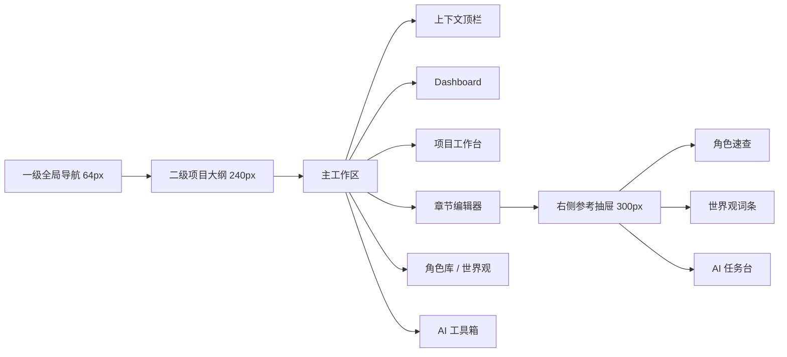

# req-022 沉浸式写作工作台与 Tiptap 编辑器重构

## 背景

StoryWeave 当前已经具备项目、章节、基础编辑器、AI 续写、角色库与部分世界观维护能力，但整体产品形态仍偏“页面集合”，尚未形成适合长时间创作的专业工作台。

当前主要问题：

1. 全局导航仍偏页面跳转思维，缺少持续性的工作台框架。
2. 项目工作台、编辑器、AI 工具箱之间的上下文仍不够连贯。
3. 编辑器仍停留在基础输入容器阶段，缺少结构化文档模型与内联 AI 交互。
4. 角色、世界观、AI 能力虽已开始建设，但尚未真正嵌入写作主链路。
5. 视觉层级仍存在卡片化过重、工作区深度不足、暗色界面噪音偏高的问题。

本需求用于承接下一轮产品级重构，将 StoryWeave 从“功能可用”推进到“工作流连贯、编辑体验沉浸、上下文联动”的创作型工作台。

---

## 目标

本轮重构目标：

1. 建立双层侧边栏 + 主工作区 + 右侧辅助抽屉的全局工作台骨架。
2. 用 Tiptap 替换现有基础编辑器，建立可扩展的文档模型。
3. 实现标题正文一体化、角色 Mention、Bubble Menu、Slash Command、AI Diff 等核心写作交互。
4. 重构 Dashboard、项目工作台、AI 工具箱、角色库、世界观页的信息架构与视觉层级。
5. 让角色、世界观、AI 能力以“上下文联动”方式介入写作，而不是作为割裂页面存在。
6. 建立统一的暗色设计 token、布局约束、交互节奏与快捷键规则。

---

## 设计原则

### 1. 从功能陈列走向上下文连贯

用户在写作时不应频繁中断。页面切换应尽量表现为“当前视角的变化”，而不是离开当前创作现场。

### 2. 去卡片化，改用层级与留白表达结构

主工作区不依赖大面积边框、阴影和卡片堆叠分区，而用背景色阶、间距、排版和轻量分割线表达空间深度。

### 3. 优先保护正文心流

最高优先级始终是写作主区。设定参考、AI 工具、结构导航都应是辅助层，不能持续抢走视觉重心。

### 4. 把 AI 变成编辑器内工作流，而不是外部聊天框

AI 操作应尽量基于选区、光标、上下文和差异对比结果展开，用户可快速接受或放弃。

### 5. 让结构化资产参与创作

角色、世界观、项目备注不应只停留在独立页面，而应在编辑器、工作台和 AI 工具箱中可见、可调用、可消费。

---

## 范围

### 纳入本轮范围

1. 全局布局重构
2. Dashboard 重构
3. 项目工作台重构
4. 章节编辑器重构
5. 右侧参考抽屉联动
6. 角色 Mention 与悬停卡片
7. Bubble Menu 与 Slash Command
8. AI 改写 Diff 工作流
9. AI 工具箱工作台化重构
10. 角色库与世界观页的主从视图重构
11. 暗色设计 token、快捷键、保存反馈与基础微交互

### 当前实现快照（截至 2026-04-28）

1. 已完成统一 App Shell、双层侧边栏、右侧辅助抽屉与上下文顶栏。
2. 已完成 Dashboard、项目工作台、世界观页、设置页、AI 工具箱的第一轮工作台化改造。
3. 已完成 Tiptap 替换、标题正文一体化、Bubble Menu、Slash Command、Mention 与角色 Hover Card。
4. 已完成编辑器选区级 AI 触发、Diff 预览、`Tab` 接受、`Esc` 放弃、右侧 AI 工作台联动与正文近邻候选块。
5. 已完成 AI 工具箱任务式布局、历史回看、继续加工、结果回带编辑器、常用意图层与高级参数折叠。
6. 已完成 `Ctrl+B`、`Ctrl+J` 与 Zen Mode 的基础闭环。
7. 当前剩余重点为响应式实机校验、角色库进一步统一收口，以及最终验收材料补齐。

### 暂不纳入本轮范围

1. 多用户协作
2. 全量导出系统重做
3. 段落级历史系统的完整实现
4. 草稿 A/B 分支的完整产品化
5. 复杂的长篇上下文自动摘要与压缩策略
6. 完整的世界观自动引用与知识图谱系统
7. AI 模型编排平台化重构

---

## 目标信息架构

---

## 需求分解

## Epic 1：全局工作台骨架

### 用户价值

作为重度创作者，我需要稳定的全局工作台框架，保证我在首页、项目页、编辑器、AI 工具页之间切换时，导航心智和空间结构保持一致。

### Story 1.1 一级全局导航

需求：

1. 左侧提供宽度约 `64px` 的极简导航栏。
2. 导航项至少包含：首页、角色库、AI 工具箱、设置。
3. 导航以图标为主，必要时配合 tooltip。
4. 背景使用全站最深色阶，与主工作区形成明显层级差。

验收标准：

1. 一级导航在所有核心页面保持位置和宽度一致。
2. 当前路由有明确激活态。
3. 收窄视口下不出现文本挤压和按钮跳动。

### Story 1.2 二级项目大纲

需求：

1. 左侧提供宽度约 `240px` 的项目上下文侧栏。
2. 在项目相关页面展示章节树、卷标题、回收站、项目入口。
3. 支持完全折叠或隐藏，把空间让给主编辑区。
4. 在非项目页可切换为空态、列表态或隐藏态。

验收标准：

1. 项目页和编辑器页可共享大纲侧栏模型。
2. 折叠状态在页面内切换时行为一致。
3. 折叠展开不导致主编辑区闪跳。

### Story 1.3 右侧辅助抽屉

需求：

1. 提供默认隐藏的右侧抽屉，宽度约 `300px`。
2. 抽屉采用 Tab 结构，至少包含：角色速查、世界观词条、AI 任务台。
3. 可由快捷键、按钮或上下文动作唤起。
4. 不抢占主工作区常驻焦点。

验收标准：

1. 抽屉默认关闭，不影响正文主区宽度。
2. 打开和关闭有统一动画与层级。
3. 切换 Tab 不丢失当前编辑上下文。

### Story 1.4 上下文顶栏

需求：

1. 用页面级顶栏替代官网式全局顶栏。
2. 根据页面展示面包屑、当前对象名称、保存状态和快捷操作。
3. 在编辑器场景仅保留极简状态信息，避免抢视线。

验收标准：

1. 编辑器页顶栏可显示“项目 / 章节”与保存状态。
2. 工作台页顶栏可显示项目级动作。
3. 顶栏内容随路由切换但结构不失控。

---

## Epic 2：Dashboard 重构

### 用户价值

作为作者，我打开产品后最关心的是“我上次写到哪了”和“现在应该从哪里继续”，而不是看到一堆并列功能卡片。

### Story 2.1 最近进展看板

需求：

1. 首页顶部用 1 到 2 个焦点区展示最近编辑项目、最近章节和写作进度。
2. 提供最醒目的“继续写作”入口。
3. 用摘要或最近片段提示当前续写位置。

验收标准：

1. 用户打开首页后能在首屏找到最近写作入口。
2. 焦点区不再被营销式 hero 卡片占据。
3. 最近项目和最近章节数据真实可用。

### Story 2.2 高密度项目列表

需求：

1. 其他项目采用表格或紧凑列表展示，不再使用大卡片墙。
2. 列表项展示项目名、最后更新时间、进度和基础状态。
3. 支持快速进入项目或继续写作。

验收标准：

1. 列表密度明显高于旧版卡片布局。
2. 行内操作不会破坏扫描效率。
3. 空状态和大量项目时都能稳定表现。

### Story 2.3 快速创建与灵感收件

需求：

1. “创建项目”入口不占首页中心黄金位。
2. 可采用 FAB、导航高优先入口或紧凑工具栏按钮。
3. 预留 Quick Capture 轻量灵感记录入口。

验收标准：

1. 新建入口易找但不压制“继续写作”。
2. 快速记录入口不要求完整建项目流程。

---

## Epic 3：项目工作台重构

### 用户价值

作为作者，我需要一个“大本营”统一管理结构、设定、进度和章节，而不是在拥挤的三栏里寻找入口。

### Story 3.1 工作台信息层级重建

需求：

1. 弱化项目简介等静态信息。
2. 强化字数、章节数、最近更新、最近创作趋势等动态信息。
3. 将工作台拆分为结构导航、项目大盘、章节管理三个主要层次。

验收标准：

1. 首屏能看出项目当前写作状态。
2. 静态信息不再挤占主要操作区域。

### Story 3.2 创作动态图谱

需求：

1. 引入类似 contribution graph 的创作热力图或字数动态图谱。
2. 以可视化方式反馈持续创作成果。

验收标准：

1. 图谱能展示最近一段时间的创作活跃度。
2. 数据来源明确，不是静态占位。

### Story 3.3 章节管理器

需求：

1. 章节列表改为高密度列表或表格。
2. 支持拖拽排序、批量操作和快速进入编辑器。
3. 点击章节后进入完整编辑器页，而不是停留在页面中部预览。

验收标准：

1. 长篇项目下章节管理仍可扫描。
2. 拖拽与批量操作不干扰主要阅读路径。

### Story 3.4 角色绑定交互升级

需求：

1. 项目角色绑定优先采用列表拖拽或直接关联交互。
2. 降低弹窗依赖。
3. 为后续设定联动与 AI 上下文选择提供基础结构。

验收标准：

1. 用户能在项目内清晰区分全局角色与已绑定角色。
2. 绑定和移除的路径短且反馈清晰。

---

## Epic 4：Tiptap 编辑器底座替换

### 用户价值

作为作者，我需要一个真正适合长时间写作和后续智能增强的编辑器，而不是标题、正文、AI 操作割裂的基础输入框组合。

### Story 4.1 Tiptap 替换基础编辑器

需求：

1. 用 Tiptap 替换现有 `input + textarea` 或类似基础组合。
2. 第一阶段先保持文本编辑体验稳定。
3. 建立后续可扩展的文档模型、选区和节点能力。

验收标准：

1. 正常输入、删除、选区、粘贴、保存流程不劣化。
2. 旧章节内容可平滑迁移或兼容显示。

### Story 4.2 标题与正文一体化

需求：

1. 在 Tiptap 中定义首行标题节点或等价文档结构。
2. 标题有独立 placeholder 和样式。
3. 用户按一次回车即可自然进入正文。

验收标准：

1. 不再出现视觉上的“标题输入框 + 正文输入框”断裂。
2. 标题到正文切换路径自然。

### Story 4.3 沉浸式正文容器

需求：

1. 正文主区居中展示，限制舒适行宽。
2. 背景、行高、字色按长时间写作优化。
3. 辅助 UI 不应在默认状态下侵入正文。

验收标准：

1. 在桌面端正文区具备稳定阅读宽度。
2. 右侧抽屉关闭时视觉重心完全回到正文。

---

## Epic 5：编辑器内智能交互

### 用户价值

作为作者，我希望角色识别、AI 润色、设定检查等能力直接发生在正文上下文里，而不是跳出页面切换工具。

### Story 5.1 Mention Extension

需求：

1. 支持输入 `@角色名` 触发角色 Mention。
2. 支持根据角色库自动识别正文中的角色名并转为实体节点。
3. Mention 节点具有轻量视觉区分，但不喧宾夺主。

验收标准：

1. 用户可主动插入角色 Mention。
2. 自动识别策略可控，不造成大面积误判。

### Story 5.2 角色悬停卡片

需求：

1. 悬停 Mention 节点时弹出极简信息卡。
2. 卡片至少展示性格、项目备注、核心标签等关键信息。
3. 卡片必须轻量、快速、可关闭。

验收标准：

1. 用户无需跳出页面即可查看角色关键设定。
2. 浮层不遮挡过多正文。

### Story 5.3 Slash Command

需求：

1. 输入 `/` 触发命令菜单。
2. 至少提供：续写、插入角色、设定检查。
3. 命令菜单支持键盘选择。

验收标准：

1. 常用操作不必再绕去右侧面板。
2. 菜单在中文输入场景下行为稳定。

### Story 5.4 Bubble Menu

需求：

1. 选中正文后在选区上方弹出极简工具条。
2. 至少提供：AI 润色、扩写、改写、设定一致性检查。
3. 工具条样式克制，不遮挡主要文本。

验收标准：

1. 选区出现时工具条反馈及时。
2. 不选中文本时工具条不常驻。

---

## Epic 6：AI 改写与 Diff 工作流

### 用户价值

作为作者，我需要 AI 给出“可比较、可接受、可放弃”的结果，而不是直接覆盖正文或把结果丢到聊天框里。

### Story 6.1 选区 AI 操作触发

需求：

1. Bubble Menu 与右侧 AI 任务台都可发起选区级改写任务。
2. 支持润色、扩写、改写、设定一致性检查等动作。

验收标准：

1. AI 请求上下文与选区绑定清晰。
2. 操作结果回到当前选区附近，而不是跳出当前文档。

### Story 6.2 Diff 呈现

需求：

1. AI 结果以差异对比形式显示在选区下方或近邻区域。
2. 原文与候选内容边界清晰。
3. 流式返回时具备占位和加载反馈。

验收标准：

1. 用户能快速识别新增、删减和替换内容。
2. 结果区不会永久污染正文布局。

### Story 6.3 接受与放弃机制

需求：

1. 支持 `Tab` 接受结果。
2. 支持 `Esc` 放弃结果。
3. 支持重新生成和插入到光标位置等扩展动作。

验收标准：

1. 快捷键与编辑器默认行为不冲突。
2. 接受后结果能稳定写回文档模型。

---

## Epic 7：右侧参考抽屉联动

### 用户价值

作为作者，我需要在写作中被动获得设定支持，而不是停下来手动搜索世界观和角色资料。

### Story 7.1 角色速查

需求：

1. 抽屉内展示当前项目相关角色的速查列表。
2. 角色支持快速展开关键信息。
3. 当前章节高关联角色优先展示。

### Story 7.2 世界观词条联动

需求：

1. 编辑器根据光标附近关键词识别世界观词条。
2. 抽屉自动滚动或定位到对应词条。
3. 未命中时保持克制，不制造噪音。

### Story 7.3 AI 任务台

需求：

1. 抽屉内可快速发起续写、改写、检查等动作。
2. 可共享当前章节、当前选区、当前项目设定上下文。

验收标准：

1. 抽屉联动帮助用户少搜索、少跳页。
2. 自动联动可关闭或弱化，避免过度打扰。

---

## Epic 8：角色库与世界观页重构

### 用户价值

作为作者，我需要像维护设定文档一样维护角色和世界观，而不是面对后台式表单页面。

### Story 8.1 角色库主从视图

需求：

1. 页面采用 Master-Detail 双栏结构。
2. 左栏提供搜索、筛选、标签和角色列表。
3. 右栏提供详情与编辑工作区。

### Story 8.2 世界观页主从视图

需求：

1. 项目世界观页面采用与角色库一致的主从模式。
2. 支持词条化维护，而不是单一大文本块。
3. 与编辑器关键词联动结构保持一致。

### Story 8.3 文档化表单风格

需求：

1. 降低“后台管理表单”观感。
2. 采用点击即编辑、弱边框或底边输入风格。
3. 保持排版像设定文档而不是 CMS 后台。

验收标准：

1. 页面观感更像创作资产目录。
2. 结构化字段仍清晰可编辑。

---

## Epic 9：AI 工具箱工作台化

### 用户价值

作为作者，我需要的是一套结构化任务流，而不是普通对话框。

### Story 9.1 输入与结果对照布局

需求：

1. AI 工具箱采用左右对照或上下对照布局。
2. 左侧或上半区为输入与任务配置。
3. 右侧或下半区为生成结果与对比视图。

### Story 9.2 任务类型与高级参数分层

需求：

1. 用 Tab 明确区分续写、改写、检查等任务。
2. 高级参数默认折叠，仅对高级用户开放。

### Story 9.3 生成历史侧栏

需求：

1. 提供历史记录侧栏。
2. 支持回看、复用、重新采纳前次结果。

验收标准：

1. AI 工具箱从聊天式体验转为任务式体验。
2. 用户能快速回看最近一次有价值的生成结果。

---

## Epic 10：视觉系统与交互规范

### 用户价值

作为长时间写作者，我需要一个低噪音、层级稳定、反馈克制的深色工作环境。

### Story 10.1 暗色设计 token

需求：

1. 建立背景色阶、文字层级、Accent、Border、Radius、间距 token。
2. 统一正文、侧栏、浮层、抽屉、列表、表格的视觉规则。

建议基线：

- 基座：`#0F0F11`
- 主工作区：`#18181B`
- 浮层：`#27272A`
- 正文文字：`#E4E4E7`
- 次级文字：`#A1A1AA`
- 辅助文字：`#52525B`

### Story 10.2 快捷键与微交互

需求：

1. 定义至少以下快捷键：
   - `Ctrl+S` 保存
   - `Ctrl+B` 切换侧边栏
   - `Ctrl+J` 唤起内联 AI 指令
2. 保存状态采用轻量 toast 或状态点反馈。
3. 避免中心弹窗式打断反馈。

### Story 10.3 响应式与 Zen Mode

需求：

1. 支持在不同视口下优雅折叠左右辅助层。
2. 编辑器页支持更纯净的 Zen Mode。

验收标准：

1. 桌面端和较窄屏幕下都不出现明显重叠。
2. Zen Mode 下用户可专注正文。

---

## 实施顺序

### P0 基础骨架

1. 设计 token 与布局壳
2. 双层侧边栏与右侧抽屉
3. 上下文顶栏

### P0 编辑器底座

1. Tiptap 替换现有编辑器
2. 标题正文一体化
3. 自动保存与选区能力稳定

### P0 智能编辑闭环

1. Bubble Menu
2. Slash Command
3. Mention 与角色悬停卡片
4. AI Diff 与接受/放弃机制

### P1 页面重构

1. Dashboard 看板化
2. 项目工作台重构
3. 角色库与世界观主从视图
4. 右侧参考抽屉联动

### P2 AI 工具箱工作台化

1. 对照布局
2. 生成历史
3. 参数折叠与结果复用

### P2 打磨与验收

1. 快捷键体系
2. 响应式与 Zen Mode
3. 视觉统一与验收清单

---

## 里程碑

### M1：工作台壳层完成

完成标准：

1. 新的 App Shell 稳定运行
2. 一级导航、项目侧栏、右侧抽屉、上下文顶栏可用

### M2：编辑器底座完成

完成标准：

1. Tiptap 替换完成
2. 标题正文一体化可用
3. 基本输入、保存、选区稳定

### M3：智能编辑成立

完成标准：

1. Bubble Menu、Slash Command、Mention、Hover Card 可用
2. 右侧参考抽屉具备基础联动

状态：已完成

### M4：AI 改写闭环完成

完成标准：

1. 选区 AI 操作可用
2. Diff 呈现可用
3. `Tab` 接受、`Esc` 放弃可用

状态：已完成

### M5：全站工作台统一

完成标准：

1. Dashboard、项目工作台、角色库、世界观、AI 工具箱完成重构
2. 视觉和交互规范统一

状态：进行中

---

## 风险与约束

1. Tiptap 文档模型与现有章节数据兼容成本较高。
2. 中文文本中的角色自动识别容易出现误判，需要可控策略。
3. AI Diff 的内联渲染与接受逻辑实现复杂度高。
4. 多侧栏、多抽屉、多快捷键会提高状态管理复杂度。
5. 当前 Phase 2 尚未完全收口，本需求与既有角色/世界观建设存在交叉依赖。

---

## 依赖关系

1. 角色库与项目角色关联能力需要作为 Mention、角色速查和 AI 上下文的基础。
2. 世界观结构化数据需要作为抽屉联动和设定检查的基础。
3. 当前编辑器保存链路必须先抽象清楚，再替换为 Tiptap。
4. AI 请求与结果写回协议需要统一，否则 Bubble Menu、右侧 AI 任务台、AI 工具箱会出现重复实现。

---

## 最小可执行包

若需要先落第一轮实现，优先做以下四项：

1. 全局布局壳重构
2. Dashboard 与项目工作台骨架重构
3. Tiptap 替换现有编辑器
4. Bubble Menu 第一版 AI 改写

这四项完成后，产品整体形态和核心写作工作流会先完成一次质变，后续再叠加 Mention、右侧抽屉联动、AI Diff 和资产页重构。

---

## 预期结果

本需求完成后，StoryWeave 应至少满足以下结果：

1. 用户可以在统一工作台框架下完成“进入项目 - 进入章节 - 写作 - 调用 AI - 查看设定”的连续流程。
2. 编辑器不再存在标题与正文割裂问题。
3. 角色与世界观能在写作上下文中即时出现和被消费。
4. AI 能以内联、可比较、可接受的方式介入，而不是打断正文创作。
5. Dashboard、工作台、编辑器、角色库、世界观、AI 工具箱拥有统一的深色专业生产力视觉语言。
