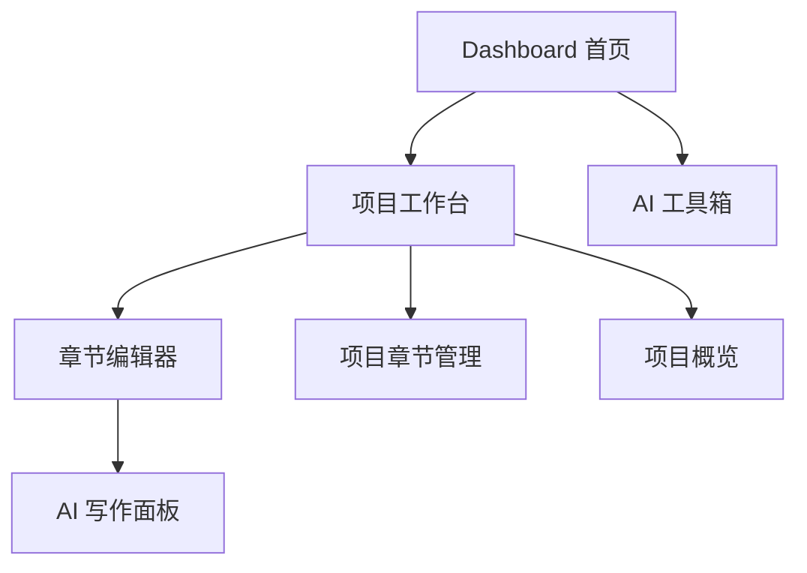

# AI 同人文写作平台 — 实现规划

## Context

用户想构建一个**个人使用**的 AI 同人文/小说创作 Web 应用，支持 ACG 二创、影视同人、原创小说等多种类型。核心需求：角色设定 + 剧情生成、章节续写 + 风格模仿、完整写作工作流、大纲到正文的人机协作，以及 Claude 与 OpenAI 的组合使用。

---

## 当前阶段状态

### 已完成归档
当前项目已经完成 Phase 1 与 Phase 1.5 的开发与验收，可直接参考：
- [`plans/phase1-completed-summary.md`](plans/phase1-completed-summary.md)
- [`plans/phase1-manual-acceptance-checklist.md`](plans/phase1-manual-acceptance-checklist.md)
- [`plans/phase1-current-status-conclusion.md`](plans/phase1-current-status-conclusion.md)

### 当前主执行文档
下一轮开发以以下文档为准：
- [`plans/phase2-detailed-plan.md`](plans/phase2-detailed-plan.md)

### 历史规划文档
以下文档保留作为历史阶段记录：
- [`plans/mvp-phase1-next-step.md`](plans/mvp-phase1-next-step.md)
- [`plans/mvp-phase1-acceptance-checklist.md`](plans/mvp-phase1-acceptance-checklist.md)
- [`plans/storyweave-product-layout-upgrade.md`](plans/storyweave-product-layout-upgrade.md)

---

## 技术栈

### 前端

| 层 | 选型 | 理由 |
|---|---|---|
| **框架** | React 19 + Vite | 主流成熟，生态丰富，构建快 |
| **语言** | TypeScript | 类型安全，适合复杂创作数据结构 |
| **路由** | React Router v7 | 适合当前前端结构 |
| **UI 组件库** | shadcn/ui + Radix UI | 与当前 Tailwind 架构匹配 |
| **状态管理** | TanStack Query + React 局部状态 | 贴合当前服务端拉取模式 |
| **HTTP 请求** | Axios | 保持统一 API 客户端能力 |
| **样式** | Tailwind CSS v4 | 便于快速迭代写作型界面 |

### 后端

| 层 | 选型 | 理由 |
|---|---|---|
| **框架** | Python FastAPI | 异步能力好，适合 AI API 集成 |
| **ORM** | SQLAlchemy 2.0 + Alembic | 主流 Python 数据层方案 |
| **数据库** | PostgreSQL 16 | 适合结构化与半结构化创作数据 |
| **AI 集成** | openai SDK + anthropic SDK | 保持原生调用能力 |
| **流式输出** | SSE | 当前链路已验证可用 |
| **验证** | Pydantic v2 | 与 FastAPI 配套 |

---

## 当前系统形态

当前已经具备：
- 项目管理
- 章节管理
- 写作编辑器
- AI 续写
- 版本历史最小闭环
- 创作型首页与 AI 工具箱入口

当前仍待补齐的关键资产层：
- 角色库
- 项目内角色关联
- 世界观设定
- 可复用的结构化创作上下文

---

## 分阶段规划

### Phase 1: MVP 基础
状态：**已完成**

已完成内容：
- 项目 CRUD
- 章节 CRUD 与排序
- 基础编辑器
- 自动保存与手动保存
- AI 流式续写
- 版本历史查看与恢复
- 未保存离开提醒

详细结论参考：
- [`plans/phase1-completed-summary.md`](plans/phase1-completed-summary.md)

### Phase 1.5: 体验与布局升级
状态：**已完成**

已完成内容：
- 创作型 Dashboard
- 最近项目与最近章节回流
- 结构化项目工作台
- 多工具 AI 表达
- 独立 AI 工具箱入口

详细结论参考：
- [`plans/phase1-completed-summary.md`](plans/phase1-completed-summary.md)

### Phase 2: 角色与世界观系统
状态：**当前主阶段**

目标：
- 建立角色库
- 建立项目世界观设定
- 将结构化上下文接入编辑器与 AI 工具箱

详细规划参考：
- [`plans/phase2-detailed-plan.md`](plans/phase2-detailed-plan.md)

### Phase 3: 写作流水线与大纲
状态：**后续阶段**

规划方向：
- 大纲编辑器
- AI 大纲生成与章节拆分
- 章节状态工作流
- 长篇上下文摘要管理

### Phase 4: 风格系统
状态：**后续阶段**

规划方向：
- 风格档案
- 风格分析
- 风格注入生成
- 风格一致性检查

### Phase 5: Prompt 模板与高级 AI
状态：**后续阶段**

规划方向：
- Prompt 模板库
- 模板变量系统
- 按模板路由模型
- 生成日志

### Phase 6: 协作模式与一键生成
状态：**后续阶段**

规划方向：
- 一键生成流水线
- 行内 AI 协作
- 人机交替模式
- 选中文本改写接受机制

### Phase 7: 打磨与导出
状态：**后续阶段**

规划方向：
- 导出能力
- 高级版本历史体验
- 全文搜索
- 快捷键系统
- 备份恢复

---

## 当前优先建设对象

当前最优先建设的是 Phase 2 的上下文资产层：
1. 角色库
2. 项目角色关联
3. 世界观设定
4. AI 上下文注入

原因：
- 这些能力最直接增强现有写作主链路
- 能提升 AI 输出稳定性与一致性
- 能为 Prompt 模板、大纲与长篇管理打基础

---

## 关键页面演进方向

1. **首页** `/`
   - 保持创作型入口
   - 增加角色库与设定相关入口预留位

2. **项目工作台** `/projects/[id]`
   - 承担章节结构、项目概览、角色与设定入口

3. **写作编辑器** `/projects/[id]/editor/[chapterId]`
   - 持续作为正文创作与 AI 协同主场景

4. **角色库** `/characters`
   - 作为全局角色资产中心

5. **世界观编辑** `/projects/[id]/world`
   - 作为项目级设定维护页

6. **AI 工具箱** `/ai-toolbox`
   - 逐步消费角色与世界观上下文

---

## 当前文档使用建议

如果进入实施，请按以下顺序使用文档：
1. 先看 [`plans/phase1-completed-summary.md`](plans/phase1-completed-summary.md)
2. 再看 [`plans/phase2-detailed-plan.md`](plans/phase2-detailed-plan.md)
3. 如需历史背景，再回看 [`plans/storyweave-product-layout-upgrade.md`](plans/storyweave-product-layout-upgrade.md)

---

## 当前结论

StoryWeave 已完成第一阶段闭环，当前不再以补 Phase 1 为目标，而是正式进入以角色库与世界观为核心的 Phase 2 规划与实施阶段。
