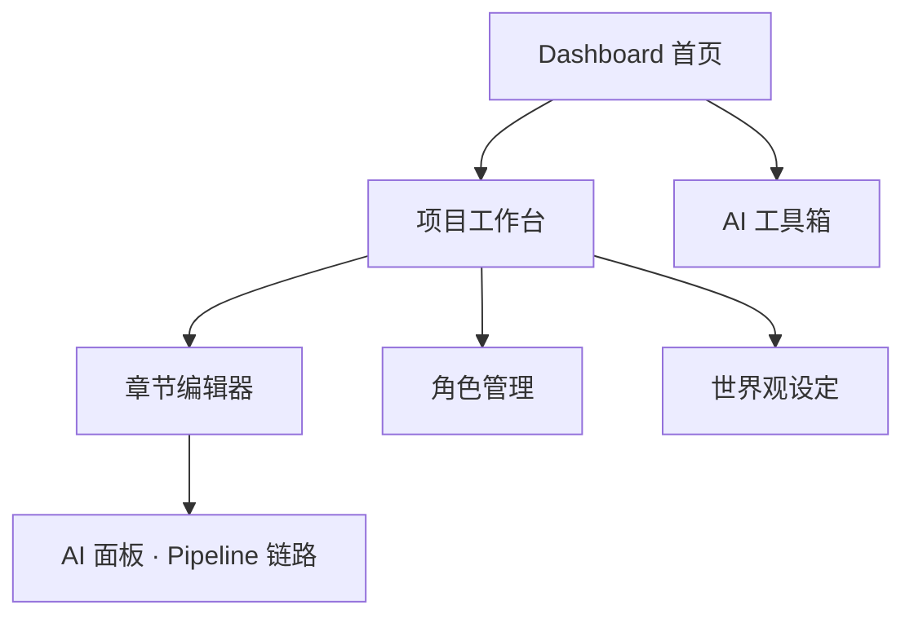

# AI 同人文写作平台 — 实现规划

## Context

用户想构建一个**个人使用**的 AI 同人文/小说创作 Web 应用，支持 ACG 二创、影视同人、原创小说等多种类型。核心需求：角色设定 + 剧情生成、章节续写 + 风格模仿、完整写作工作流、大纲到正文的人机协作，以及 Claude 与 OpenAI 的组合使用。

---

## 当前阶段状态

### 已完成归档
- Phase 1：MVP 基础链路（项目/章节/编辑器/AI 流式续写/版本历史）
- Phase 1.5：信息架构升级（Dashboard、工作台、AI 工具箱）
- Phase 2：角色库、世界观、AI 上下文注入
- Phase 3（部分）：多阶段续写流水线（Planner → Retriever → Writer → Checker）

详细历史参考：[`plans/phase1-completed-summary.md`](plans/phase1-completed-summary.md)

### 当前主执行文档
- [`plans/phase3-context-engineering-plan.md`](plans/phase3-context-engineering-plan.md) — Phase 3 总体规划
- [`plans/phase3-progress.md`](plans/phase3-progress.md) — Phase 3 当前实施状态

---

## 技术栈

### 前端

| 层 | 选型 |
|---|---|
| 框架 | React 19 + Vite |
| 语言 | TypeScript |
| 路由 | React Router v7 |
| UI 组件库 | shadcn/ui + Radix UI |
| 状态管理 | TanStack Query + React 局部状态 |
| HTTP 请求 | Axios |
| 样式 | Tailwind CSS v4 |

### 后端

| 层 | 选型 |
|---|---|
| 框架 | Python FastAPI |
| ORM | SQLAlchemy 2.0 + Alembic |
| 数据库 | PostgreSQL 16 |
| AI 集成 | openai SDK + anthropic SDK |
| 流式输出 | SSE |
| 验证 | Pydantic v2 |

---

## 当前系统形态

```mermaid
flowchart TD
  A[Dashboard 首页] --> B[项目工作台]
  B --> C[章节编辑器]
  C --> D[AI 面板 · Pipeline 链路]
  B --> E[角色管理]
  B --> F[世界观设定]
  A --> G[AI 工具箱]
```

当前已具备：
- 项目 / 章节管理
- Tiptap 富文本编辑器 + 自动保存
- AI 续写（旧链路 SSE 流式 + 新 Pipeline 链路）
- 版本历史查看与恢复
- 角色库 + 项目角色关联
- 世界观设定
- 章节级结构化记忆（ChapterMemory）+ 项目级长期记忆（ProjectStoryMemory）
- 正文 chunk 切分与向量检索
- 多阶段续写流水线：Planner → Retriever → Writer → Checker
- Pipeline 调试接口（`/api/ai/continuation/debug`）
- 多用户 JWT 认证与数据隔离

---

## 分阶段规划

### Phase 1：MVP 基础
状态：**已完成**

### Phase 1.5：体验与布局升级
状态：**已完成**

### Phase 2：角色与世界观系统
状态：**已完成**

已完成内容：
- 角色库 CRUD
- 项目角色关联
- 世界观设定页
- AI 上下文注入最小闭环

详细参考：[`plans/phase2-detailed-plan.md`](plans/phase2-detailed-plan.md)

### Phase 3：上下文工程与续写流水线
状态：**进行中**

已完成内容：
- 章节记忆抽取（`chapter_memory_service`）
- 项目长期记忆聚合（`story_memory_service`）
- 正文 chunk 切分与检索（`context_retrieval_service`）
- 多阶段续写流水线（`continuation_pipeline_service`）
- Planner（`continuation_planner_service`）：规则 + LLM 结构化规划
- Continuity Checker（`continuity_checker_service`）：规则 + LLM 双层校验
- 多用户认证体系

待完成内容：
- 剧情图谱系统（`graph_evidence` 当前为空）
- Benchmark 体系落地（数据集与回放脚本）
- 生成后记忆回写钩子（chunk / memory / story memory 异步刷新）
- Checker 自动重写闭环（当前仅报警）

详细参考：
- [`plans/phase3-context-engineering-plan.md`](plans/phase3-context-engineering-plan.md)
- [`plans/phase3-progress.md`](plans/phase3-progress.md)
- [`plans/continuation-pipeline-design.md`](plans/continuation-pipeline-design.md)
- [`plans/memory-schema-design.md`](plans/memory-schema-design.md)
- [`plans/benchmark-design.md`](plans/benchmark-design.md)

### Phase 4：风格系统
状态：**后续阶段**

规划方向：风格档案、风格分析、风格注入生成、风格一致性检查

### Phase 5：Prompt 模板与高级 AI
状态：**后续阶段**

规划方向：Prompt 模板库、模板变量系统、按模板路由模型

### Phase 6：一键生成与协作模式
状态：**后续阶段**

规划方向：一键生成流水线、行内 AI 协作、选中文本改写

### Phase 7：打磨与导出
状态：**后续阶段**

规划方向：导出能力、全文搜索、备份恢复、高级版本历史

---

## 当前文档使用建议

1. 了解已完成功能 → [`plans/phase1-completed-summary.md`](plans/phase1-completed-summary.md)
2. 了解当前阶段进度 → [`plans/phase3-progress.md`](plans/phase3-progress.md)
3. 了解 Pipeline 设计细节 → [`plans/continuation-pipeline-design.md`](plans/continuation-pipeline-design.md)
4. 了解 Memory 数据结构 → [`plans/memory-schema-design.md`](plans/memory-schema-design.md)
5. 了解 Benchmark 体系 → [`plans/benchmark-design.md`](plans/benchmark-design.md)
