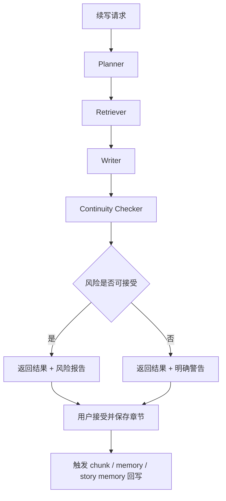

# StoryWeave Continuation Pipeline 设计稿

> 本文档是 [`phase3-context-engineering-plan.md`](./phase3-context-engineering-plan.md) 的第二份配套设计稿，聚焦 Phase 3 所需的续写流水线设计。目标不是立即把多 Agent 体系一次性做完，而是先把 StoryWeave 从“上下文增强的一步直写”升级为“规划 -> 检索 -> 写作 -> 校验 -> 回写”的单链路可控流水线。

## 一、文档目标

本设计稿用于回答四个问题：

1. 续写流水线的阶段边界如何划分
2. 每个阶段的输入输出结构应该是什么
3. 第一版如何复用当前已有的 memory / retrieval / AI 生成能力
4. Phase 3 的最小闭环应如何落地，而不把系统复杂度一次性拉满

当前阶段优先解决的是：

- 把“直接拼 prompt 然后生成”改造成可观察、可调试、可回退的流水线
- 为后续 story graph、benchmark、自动优化预留稳定接口
- 让 Planner / Retriever / Writer / Checker 的职责清晰，不互相污染

当前阶段不追求：

- 真正并行运行的多 Agent 系统
- 自动重写闭环
- 面向用户的复杂可视化编排器
- 一次返回多个候选并自动评优

## 二、当前实现基线

在进入 Phase 3 前，仓库已经具备以下基础能力：

1. **章节记忆抽取**
   - [`backend/app/services/chapter_memory_service.py`](../backend/app/services/chapter_memory_service.py)

2. **项目长期记忆聚合**
   - [`backend/app/services/story_memory_service.py`](../backend/app/services/story_memory_service.py)

3. **正文 chunk 切分**
   - [`backend/app/services/chapter_chunk_service.py`](../backend/app/services/chapter_chunk_service.py)

4. **基础检索与上下文预览**
   - [`backend/app/services/context_retrieval_service.py`](../backend/app/services/context_retrieval_service.py)
   - [`backend/app/services/ai_service.py`](../backend/app/services/ai_service.py)

5. **章节保存后的 memory / chunk 回写**
   - [`backend/app/api/routes/chapters.py`](../backend/app/api/routes/chapters.py)

这意味着 Phase 3 第一版不需要从零开始。更合理的做法是：

- 保留当前 `ai_service` 作为底层模型调用层
- 把现有 `build_generation_instruction()` 的职责逐步下沉到新 pipeline
- 先做“单服务内串行多阶段”，而不是“多个自治 Agent 并发协作”

## 三、目标形态

续写链路目标形态如下：



第一版强调三件事：

1. 每个阶段都要有结构化输出
2. 每个阶段都能单独调试和查看中间结果
3. 整条链路保留 fallback，避免因为单阶段异常导致整个续写不可用

## 四、设计原则

### 4.1 单一职责

- `Planner` 负责决定“这次要写什么”
- `Retriever` 负责决定“为这次写作拿什么上下文”
- `Writer` 负责决定“怎么写出来”
- `Checker` 负责决定“这段内容有哪些连续性风险”

禁止让：

- Planner 直接输出最终正文
- Retriever 直接生成 prompt 大段自然语言解释
- Writer 自己决定检索逻辑
- Checker 直接偷偷改写正文

### 4.2 第一版先做串行，不做自治编排

尽管计划文档里用了 “Agent” 一词，但第一版实现建议仍然是单个 `continuation_pipeline_service` 内部串行调度：

1. 调 `continuation_planner_service`
2. 调 `context_retrieval_service`
3. 调 `ai_service.generate_plain_text()` 或等价能力生成正文
4. 调 `continuity_checker_service`
5. 汇总返回

这样做有两个好处：

- 复用现有服务成本低
- 更容易 benchmark 和回归

### 4.3 所有阶段都必须可降级

如果某一阶段失败，系统应优先降级，而不是直接报错中断：

- Planner 失败 -> 使用默认续写计划
- Retriever 失败 -> 使用当前已有上下文装配逻辑
- Writer 失败 -> 整体失败，返回生成错误
- Checker 失败 -> 返回正文，但标记 `check_status = "skipped"`

### 4.4 回写不进入同步生成主链路

续写链路只负责**读取** memory / chunk / story memory。  
用户确认接受结果并保存章节后，仍由现有章节保存流程负责触发：

- chunk 刷新
- chapter memory 刷新
- story memory 聚合

第一版不在生成请求内同步执行任何 memory rebuild。

## 五、服务划分建议

建议新增以下服务：

- `backend/app/services/continuation_planner_service.py`
- `backend/app/services/continuity_checker_service.py`
- `backend/app/services/continuation_pipeline_service.py`

暂不建议立即新增：

- 真正独立运行的 worker / agent runtime
- 自动重试重写器

### 5.1 `continuation_planner_service`

职责：

- 解析用户意图
- 明确本次续写的承接点、目标、限制条件
- 将自然语言请求转成稳定的结构化计划

### 5.2 `continuity_checker_service`

职责：

- 检查候选正文与已有上下文的主要冲突
- 输出结构化风险报告
- 不修改正文，只给判定和证据

### 5.3 `continuation_pipeline_service`

职责：

- 编排 Planner / Retriever / Writer / Checker
- 汇总中间结果
- 生成最终响应
- 暴露给 API 层统一调用

## 六、核心数据契约

## 6.1 请求对象：`ContinuationRequest`

建议字段：

- `project_id`
- `chapter_id`
- `user_text`
- `user_instruction`
- `model_provider`
- `model_id`
- `temperature`
- `max_tokens`
- `owner_id`

字段说明：

- `user_text`
  - 用户提供的待续写正文、选中文本或临时素材

- `user_instruction`
  - 用户给模型的直接任务描述

- `chapter_id`
  - 可为空
  - 若为空，则退化为项目级写作任务，而不是章内续写任务

## 6.2 Planner 输出：`ContinuationPlan`

建议结构：

```json
{
  "scene_continuation_point": "",
  "writing_goal": "",
  "must_include": [],
  "must_avoid": [],
  "relevant_open_loops": [],
  "character_constraints": [],
  "timeline_constraints": [],
  "style_notes": [],
  "risk_focus": []
}
```

字段说明：

- `scene_continuation_point`
  - 从哪里接着写
  - 应尽量贴近“上一段结束时的叙事位置”

- `writing_goal`
  - 本次续写最核心要完成的一件事

- `must_include`
  - 必须出现的事件、人物、动作、信息

- `must_avoid`
  - 明确不要发生的内容，例如跳时间线、角色 OOC、过早揭露伏笔

- `relevant_open_loops`
  - 与本次续写相关的 open loops 标识或描述

- `character_constraints`
  - 对关键角色状态、口吻、关系的约束

- `timeline_constraints`
  - 时间顺序、地点、已发生事件边界

- `style_notes`
  - 例如“节奏偏慢”“压抑感先铺后爆”“延续当前叙述视角”

- `risk_focus`
  - 提醒 Writer / Checker 本次最容易出错的维度

## 6.3 Retriever 输出：`ContinuationContextBundle`

建议结构：

```json
{
  "project_summary": "",
  "story_memory_summary": "",
  "current_chapter_summary": "",
  "previous_chapter_tail": "",
  "recent_memories": [],
  "retrieved_chunks": [],
  "graph_evidence": [],
  "character_context": [],
  "world_context": [],
  "query_terms": [],
  "token_budget_report": {
    "estimated_tokens": 0,
    "trimmed_sections": []
  }
}
```

字段说明：

- `project_summary`
  - 项目级基础设定摘要

- `story_memory_summary`
  - 来自 `project_story_memories`

- `current_chapter_summary`
  - 当前章节摘要、备注等

- `previous_chapter_tail`
  - 上一章结尾原文，用于承接

- `recent_memories`
  - 最近 1~3 个章节记忆

- `retrieved_chunks`
  - 正文检索命中片段

- `graph_evidence`
  - 先预留
  - 当前第一版可为空数组

- `character_context` / `world_context`
  - 当前已有的结构化角色与设定摘要

- `query_terms`
  - 检索阶段实际使用的词项，便于调试

- `token_budget_report`
  - 记录哪些内容被裁剪或降级

## 6.4 Writer 输出：`ContinuationDraft`

建议结构：

```json
{
  "content": "",
  "model_provider": "",
  "model_id": "",
  "generation_notes": [],
  "used_sections": []
}
```

字段说明：

- `content`
  - 生成的候选正文

- `generation_notes`
  - 可选
  - 记录本次是否走了 fallback、是否缩减了上下文

- `used_sections`
  - 写作 prompt 中实际拼入的上下文块类型

## 6.5 Checker 输出：`ContinuityReport`

建议结构：

```json
{
  "severity": "low",
  "summary": "",
  "timeline_conflicts": [],
  "character_conflicts": [],
  "world_rule_conflicts": [],
  "knowledge_boundary_conflicts": [],
  "open_loop_misalignment": [],
  "evidence": [],
  "check_status": "completed"
}
```

字段说明：

- `severity`
  - `low | medium | high`

- `summary`
  - 对整体风险的简明摘要

- 五类冲突数组
  - 每项建议包含：
    - `issue`
    - `reason`
    - `evidence`
    - `suggestion`

- `check_status`
  - `completed | skipped | failed`

## 6.6 最终响应：`ContinuationPipelineResult`

建议结构：

```json
{
  "plan": {},
  "context_bundle": {},
  "draft": {},
  "continuity_report": {},
  "final_content": "",
  "warnings": [],
  "fallbacks": [],
  "metadata": {
    "planner_used": true,
    "retriever_used": true,
    "checker_used": true
  }
}
```

说明：

- API 面向前端时可只返回 `final_content + continuity_report + metadata`
- 内部调试模式或预览模式可返回完整中间对象

## 七、各阶段详细设计

## 7.1 Planner

### 输入

- `user_instruction`
- `user_text`
- 当前章节信息
- 上一章结尾
- 最近章节记忆
- 项目长期记忆摘要

### 输出目标

不是“替用户写正文”，而是回答：

1. 当前这段续写应该承接哪里
2. 这次最重要的推进目标是什么
3. 哪些伏笔 / 角色状态必须保住
4. 哪些错误最需要规避

### 第一版实现建议

第一版建议使用：

- **规则优先 + LLM 补充**

流程建议：

1. 先根据当前请求和章节状态构建默认计划
2. 再用轻量模型把默认计划补成结构化输出
3. 如果 LLM 失败，直接使用默认计划

默认计划示例：

- `scene_continuation_point` 来自上一章结尾或当前选中文本
- `writing_goal` 来自用户指令中的续写目标
- `must_include` 来自最近 memory 中高优先级 open loops
- `must_avoid` 默认包含跳时间线、改人设、强行回收伏笔

## 7.2 Retriever

### 输入

- `ContinuationPlan`
- 项目 / 章节信息
- `ChapterMemory`
- `ProjectStoryMemory`
- 结构化角色和世界观

### 输出目标

输出一个**可控、可解释、可裁剪**的上下文包，而不是无上限拼接历史文本。

### 第一版实现建议

第一版直接复用：

- `ai_service._load_generation_context()`
- `context_retrieval_service.retrieve_for_generation()`

在此基础上新增一个 bundle assembler：

1. 读取项目摘要
2. 读取 story memory
3. 读取当前章节摘要与上一章结尾
4. 拉最近章节 memory
5. 拉正文 chunk 检索结果
6. 统一做 token budget 裁剪

### 与未来 graph 的关系

当前 `graph_evidence` 可为空数组。  
后续当 `story_graph_service` 完成后，再把：

- 实体命中
- 事件命中
- 关系命中
- open loop 命中

并入统一 bundle。

## 7.3 Writer

### 输入

- `ContinuationPlan`
- `ContinuationContextBundle`
- `user_text`
- `user_instruction`

### 输出目标

只生成单个候选正文，优先保证：

1. 承接自然
2. 人设稳定
3. 信息边界不越线
4. 不主动制造明显 continuity bug

### Prompt 组装原则

写作 prompt 应分层：

1. 用户原始任务
2. Planner 输出的结构化写作要求
3. Retriever 输出的上下文包
4. 明确写作要求

建议格式：

- 写作目标
- 必须包含
- 必须避免
- 相关剧情记忆
- 相关检索片段
- 角色与世界观约束
- 用户输入正文

### 第一版实现建议

第一版不新增底层模型调用器，继续复用：

- `ai_service.generate_plain_text()`

但应避免继续把所有逻辑都塞进 `instruction` 字符串。  
更合理的方式是由 `continuation_pipeline_service` 显式组装 Writer prompt。

## 7.4 Continuity Checker

### 输入

- `ContinuationPlan`
- `ContinuationContextBundle`
- `ContinuationDraft.content`

### 输出目标

生成结构化风险报告，而不是泛泛而谈的“感觉还行”。

### 检查维度

1. **timeline conflicts**
   - 是否跳过当前时点
   - 是否错误切换地点或时序

2. **character conflicts**
   - 口吻漂移
   - 立场反转无铺垫
   - 已知状态与正文冲突

3. **world rule conflicts**
   - 违反世界规则
   - 违背已确认设定

4. **knowledge boundary conflicts**
   - 角色知道了本不该知道的信息
   - 提前暴露秘密

5. **open loop misalignment**
   - 该推进的线没推进
   - 不该回收的线被提前回收

### 第一版实现建议

第一版可直接让 LLM 输出 JSON 风险报告，同时配合少量规则前置检查：

- 如果地点和时间标记明显冲突，先写入 rule-based issue
- 再让 LLM 做更高层次判断

如果 Checker 调用失败：

- 不阻断正文返回
- 标记 `check_status = "skipped"`

## 八、编排逻辑设计

## 8.1 主流程

建议伪代码：

```python
async def run_continuation_pipeline(request):
    loaded = await load_base_context(request)

    plan = await planner.plan(request, loaded)
    context_bundle = await retriever.retrieve(request, loaded, plan)
    draft = await writer.write(request, plan, context_bundle)
    continuity_report = await checker.check(request, plan, context_bundle, draft)

    return assemble_result(plan, context_bundle, draft, continuity_report)
```

## 8.2 异常与 fallback

建议策略：

1. Planner 失败
   - 使用 `build_default_plan()`

2. Retriever 失败
   - 使用当前 `ai_service.build_generation_context_preview()` 所依赖的简化上下文

3. Writer 失败
   - 返回错误

4. Checker 失败
   - 返回正文 + `check_status = "skipped"`

## 8.3 调试模式

建议 `continuation_pipeline_service` 支持两种返回模式：

1. **production mode**
   - 返回正文与风险报告

2. **debug mode**
   - 额外返回：
     - plan
     - query terms
     - retrieved chunks
     - token budget report
     - fallbacks

这会显著降低后续调试成本。

## 九、与现有 API 的衔接建议

## 9.1 第一阶段：内部替换，不改前端接口

优先方案：

- 保持现有 `/api/ai/generate` 和 `/api/ai/generate-once` 入口不变
- 在内部逐步把 `ai_service.build_generation_instruction()` 替换为 pipeline 方案

这样可以避免一次性冲击前端。

## 9.2 第二阶段：增加 pipeline 专用接口

当链路稳定后，再新增：

- `POST /api/ai/continuation/plan-preview`
- `POST /api/ai/continuation/context-preview`
- `POST /api/ai/continuation/generate`
- `POST /api/ai/continuation/check`

用途：

- 给前端显示“本次续写计划”
- 给内部做 benchmark 与调试

## 9.3 与当前预览接口的关系

现有：

- `/api/ai/context-preview`
- `/api/ai/retrieval-preview`

短期继续保留。  
后续可以演进为 pipeline 的中间结果预览接口。

## 十、第一版实施顺序

建议按以下顺序推进：

### Step 1：补服务骨架

- 新增 `continuation_planner_service.py`
- 新增 `continuity_checker_service.py`
- 新增 `continuation_pipeline_service.py`

目标：

- 先把类和数据流跑通
- 允许内部仍复用当前 `ai_service` 与 `context_retrieval_service`

### Step 2：完成 Planner 最小闭环

目标：

- 规则默认计划
- LLM 补全结构化计划
- Planner 失败 fallback

### Step 3：完成 Context Bundle Assembler

目标：

- 把现有 memory / chunk / project context 收敛成单一 bundle 对象

### Step 4：接入 Writer

目标：

- 使用统一 Writer prompt 生成单候选正文

### Step 5：接入 Checker

目标：

- 输出结构化 continuity report
- 不阻断正文返回

### Step 6：在原 AI 接口后面灰度切换

目标：

- 先保留原入口
- 用配置开关切换“旧 instruction 拼装链路”与“新 pipeline 链路”

## 十一、验收标准

Phase 3 第一版不要求完全实现原计划中的最终态，但应满足以下标准：

1. 续写链路完成“规划 -> 检索 -> 写作 -> 校验”
2. 每个阶段都有结构化输出对象
3. 任一非 Writer 阶段失败时，系统仍能降级返回结果
4. 前端或调试接口能查看 plan / retrieval / report
5. 用户接受并保存章节后，继续复用现有 memory 回写链路

## 十二、风险与控制

### 12.1 Prompt 复杂度迅速膨胀

控制策略：

- Planner / Retriever / Writer / Checker 分层
- 不把所有说明混成一段 instruction

### 12.2 Checker 变成“第二个 Writer”

控制策略：

- Checker 只输出问题，不输出整段替代正文
- 如需自动重写，放到后续版本单独设计

### 12.3 检索包过大导致成本飙升

控制策略：

- 明确 token budget report
- 先裁剪 chunk，再裁剪长摘要，最后才裁剪角色/世界设定

### 12.4 现有主链路被大改后难以回退

控制策略：

- 初期通过 feature flag 灰度切换
- 保留旧链路一段时间用于对照

## 十三、与后续文档的关系

本设计稿完成后，后续可以继续补：

1. `benchmark-design.md`
   - 用于定义如何比较旧链路与新 pipeline

2. `story-graph-design.md` 或等价文档
   - 用于定义 Retriever 中 `graph_evidence` 的真实来源

3. Phase 3 进度盘点文档
   - 用于跟踪 Planner / Retriever / Writer / Checker 的实际完成情况

## 十四、结论

StoryWeave 的下一步不该直接跳到“复杂多 Agent 协作”，而应先完成一个**单链路、可调试、可降级的续写流水线**。  
这条链路的核心不是“多模型炫技”，而是把当前已经存在的 memory、retrieval、project context、AI 生成能力收敛成稳定的工程接口。

换句话说，Phase 3 第一版的关键不是“更聪明地写”，而是“更稳定地知道为什么这样写，以及哪里可能写错”。
