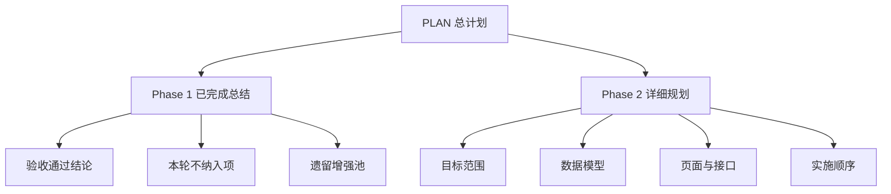

# StoryWeave 文档重构计划

## 目标
将现有计划文档重构为更贴合当前真实进度的两份核心文档：
- [`plans/phase1-completed-summary.md`](plans/phase1-completed-summary.md)：用于确认 Phase 1 与 Phase 1.5 已完成事实、验收结论、收口边界与后续遗留项归档
- [`plans/phase2-detailed-plan.md`](plans/phase2-detailed-plan.md)：用于承接下一轮开发，聚焦角色库、世界观、Prompt 模板等 Phase 2 方向的详细规划

## 新文档结构

## 拟执行动作
1. 新建 [`plans/phase1-completed-summary.md`](plans/phase1-completed-summary.md)
2. 新建 [`plans/phase2-detailed-plan.md`](plans/phase2-detailed-plan.md)
3. 更新 [`PLAN.md`](PLAN.md) 的阶段状态与导航索引
4. 保留旧文档作为历史记录，不直接删除

## 旧文档处理策略
- [`plans/mvp-phase1-next-step.md`](plans/mvp-phase1-next-step.md)：保留，视为 Phase 1 收口阶段历史文档
- [`plans/phase1-current-status-conclusion.md`](plans/phase1-current-status-conclusion.md)：保留，视为收口前结论文档
- [`plans/phase1-manual-acceptance-checklist.md`](plans/phase1-manual-acceptance-checklist.md)：保留，视为已执行验收清单
- [`plans/mvp-phase1-acceptance-checklist.md`](plans/mvp-phase1-acceptance-checklist.md)：保留，视为早期验收草案

## Phase 1 新总结文档核心内容
- 当前结论：Phase 1 与 Phase 1.5 已完成，且手工验收已全部通过
- 已落地能力：项目、章节、编辑器、AI 续写、版本历史、防误操作、Dashboard、Workspace、AI 工具箱入口
- 本轮明确不纳入项：Wangeditor、AI 服务端取消/重试/细日志、版本历史增强、包体优化
- 后续处理方式：转入增强池或后续阶段专题

## Phase 2 新规划文档核心内容
- 目标：增强创作上下文，而不是扩张无关能力
- 优先方向：角色库、项目内角色关联、世界观设定、Prompt 模板前置规划
- 与现有页面关系：项目工作台、编辑器、AI 工具箱都要能消费角色与世界观上下文
- 输出形式：分模块目标、数据模型、API、页面、实施顺序、验收标准
