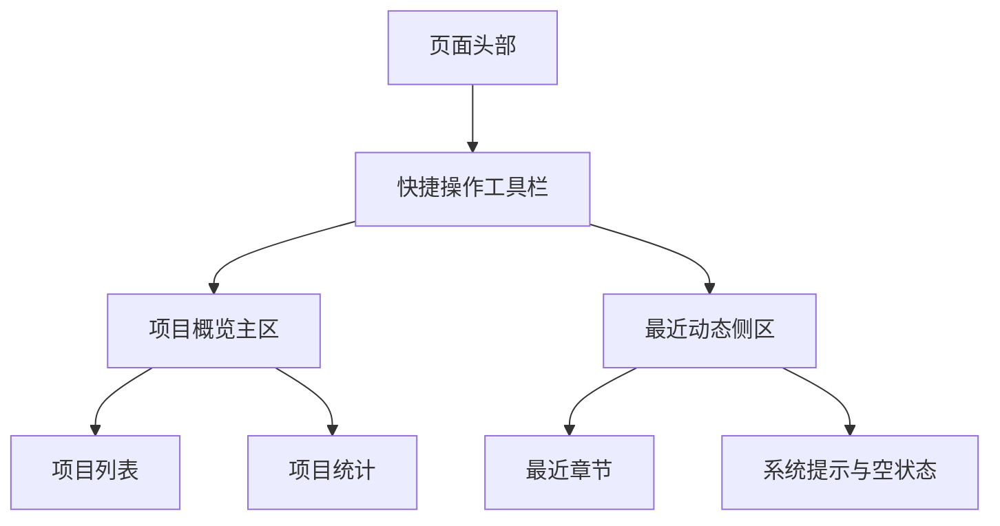
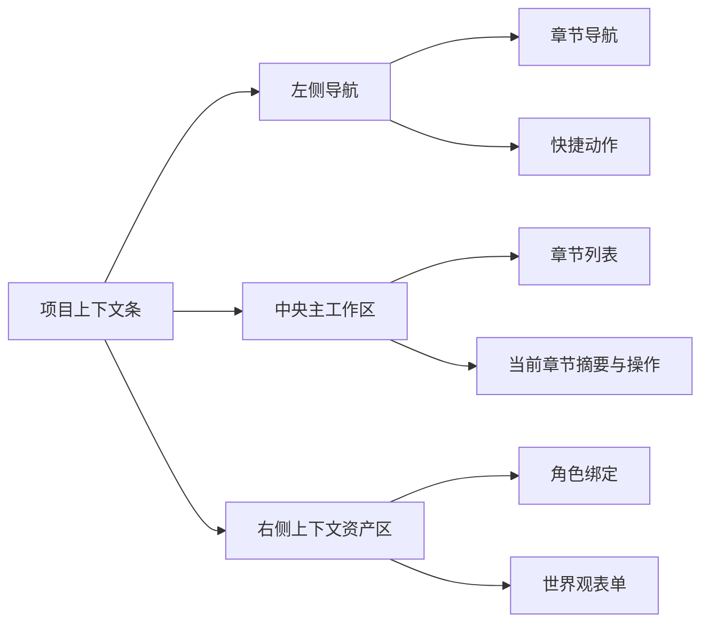

# StoryWeave 前端改版方案：基于 shadcn 的页面重构策略

## 一、目标

当前前端页面，尤其是 [`frontend/src/pages/dashboard-page.tsx`](../frontend/src/pages/dashboard-page.tsx) 与 [`frontend/src/pages/project-workspace-page.tsx`](../frontend/src/pages/project-workspace-page.tsx)，存在较明显的视觉与信息组织问题：

- 页面使用了过多 [`Card`](../frontend/src/components/ui/card.tsx) 容器进行信息切块
- 许多区域本质上是导航、操作区、表单区、列表区，却都被统一渲染成“卡片”
- 页面层级依赖视觉堆叠而不是结构分区，导致主次不清
- 已经引入的 shadcn 组件没有被充分用于“布局语义”和“交互组织”

本次改版方案目标不是简单“减少卡片数量”，而是建立一套更符合 shadcn 风格的页面组织方式：

1. 让 [`Card`](../frontend/src/components/ui/card.tsx) 回归到“承载独立信息块”的用途
2. 将页面结构改为基于 section、toolbar、form、list、dialog、separator 的组合
3. 强化主内容区、侧栏区、次级操作区的语义分层
4. 在不牺牲当前功能完整度的前提下，降低页面视觉噪音
5. 为后续角色库、世界观页、AI 工具箱建立统一的页面范式

---

## 二、现状诊断

### 1. [`frontend/src/pages/dashboard-page.tsx`](../frontend/src/pages/dashboard-page.tsx)

当前问题：

- 首屏 Hero、功能入口、统计信息、最近项目、最近章节等内容大量依赖 [`Card`](../frontend/src/components/ui/card.tsx)
- 某些卡片内部还嵌套小卡片，形成“卡片套卡片”的层层包裹
- 功能入口区实际更接近操作导航网格，而不是信息卡片集合
- 项目列表更适合列表行或数据块，而不是大型营销式卡片墙
- 最近章节区更适合时间线或紧凑列表，不适合继续堆叠展示容器

结果：

- 页面看起来很满，但真正的信息路径不清晰
- 用户难以快速分辨：哪里是操作入口，哪里是状态概览，哪里是数据列表

### 2. [`frontend/src/pages/project-workspace-page.tsx`](../frontend/src/pages/project-workspace-page.tsx)

当前问题：

- 项目头部、工作重点、结构导航、新增章节、章节列表、角色管理、世界观表单都使用卡片承载
- 左中右三栏的语义区分还不够明确，更多依赖边框盒子来制造区隔
- 角色绑定区与世界观维护区本质上是表单和资源管理区，不需要都做成独立大卡片
- 章节导航与章节详情之间还缺少更清晰的主从关系

结果：

- 工作台像一个“卡片拼贴板”，而不是一个创作控制台
- 页面虽然功能齐全，但交互重心不够集中

### 3. 当前可用的 shadcn 基础组件

当前项目已接入并可直接复用的组件包括：

- [`frontend/src/components/ui/button.tsx`](../frontend/src/components/ui/button.tsx)
- [`frontend/src/components/ui/badge.tsx`](../frontend/src/components/ui/badge.tsx)
- [`frontend/src/components/ui/card.tsx`](../frontend/src/components/ui/card.tsx)
- [`frontend/src/components/ui/dialog.tsx`](../frontend/src/components/ui/dialog.tsx)
- [`frontend/src/components/ui/input.tsx`](../frontend/src/components/ui/input.tsx)
- [`frontend/src/components/ui/select.tsx`](../frontend/src/components/ui/select.tsx)
- [`frontend/src/components/ui/textarea.tsx`](../frontend/src/components/ui/textarea.tsx)
- [`frontend/src/components/ui/separator.tsx`](../frontend/src/components/ui/separator.tsx)
- [`frontend/src/components/ui/scroll-area.tsx`](../frontend/src/components/ui/scroll-area.tsx)
- [`frontend/@/components/ui/tabs.tsx`](../frontend/@/components/ui/tabs.tsx)
- [`frontend/@/components/ui/table.tsx`](../frontend/@/components/ui/table.tsx)
- [`frontend/@/components/ui/label.tsx`](../frontend/@/components/ui/label.tsx)
- [`frontend/@/components/ui/dropdown-menu.tsx`](../frontend/@/components/ui/dropdown-menu.tsx)
- [`frontend/@/components/ui/sheet.tsx`](../frontend/@/components/ui/sheet.tsx)
- [`frontend/@/components/ui/tooltip.tsx`](../frontend/@/components/ui/tooltip.tsx)
- [`frontend/@/components/ui/skeleton.tsx`](../frontend/@/components/ui/skeleton.tsx)
- [`frontend/@/components/ui/alert-dialog.tsx`](../frontend/@/components/ui/alert-dialog.tsx)

同时，表单与交互依赖已补齐到 [`frontend/package.json`](../frontend/package.json)，包括：

- [`@hookform/resolvers`](../frontend/package.json:15)
- [`@radix-ui/react-alert-dialog`](../frontend/package.json:16)
- [`@radix-ui/react-dropdown-menu`](../frontend/package.json:18)
- [`@radix-ui/react-label`](../frontend/package.json:19)
- [`@radix-ui/react-tabs`](../frontend/package.json:22)
- [`@radix-ui/react-tooltip`](../frontend/package.json:23)
- [`react-hook-form`](../frontend/package.json:31)

另外，为确保 tooltip 类组件可全局使用，已在 [`frontend/src/App.tsx`](../frontend/src/App.tsx) 中接入 [`TooltipProvider`](../frontend/src/App.tsx:5)。

需要说明的是，本轮通过 shadcn CLI 生成的新组件目前被写入到了 [`frontend/@/components/ui`](../frontend/@/components/ui) 目录，而不是现有的 [`frontend/src/components/ui`](../frontend/src/components/ui) 目录。这说明当前 CLI 输出路径与项目别名配置之间存在偏差，后续在正式页面重构前，建议先统一组件物理目录，避免出现两套 UI 组件目录并行维护的问题。

这意味着项目已经不只是“具备基础条件”，而是已经具备推进一次完整“去卡片化、结构化页面重构”的核心组件条件。

---

## 三、改版总原则

### 原则 1：减少容器感，增强结构感

不要把每一块内容都塞进 [`Card`](../frontend/src/components/ui/card.tsx)。

建议优先使用：

- 页面级 section 分区
- 标题栏 + 描述 + 操作按钮
- [`Separator`](../frontend/src/components/ui/separator.tsx) 做区块分隔
- 列表、表单、工具栏、状态条直接作为页面结构

适合继续使用 [`Card`](../frontend/src/components/ui/card.tsx) 的场景：

- 单个项目摘要
- 独立统计指标
- 明显需要浮层感或聚焦感的区块
- 空状态、强调状态、独立模块容器

不适合继续滥用 [`Card`](../frontend/src/components/ui/card.tsx) 的场景：

- 页面主布局骨架
- 普通按钮导航集合
- 简单表单区
- 普通列表容器

### 原则 2：区分 页面骨架 与 业务模块

建议把页面拆为三层：

1. 页面级骨架
   - 标题
   - 副标题
   - 顶部操作区
   - 主内容网格

2. 模块级区块
   - 项目列表
   - 章节列表
   - 世界观表单
   - 角色绑定表单

3. 单项级元素
   - 行操作
   - Badge
   - 状态提示
   - 次级说明文本

### 原则 3：优先使用 shadcn 的交互语义，而不是视觉装饰

重点不是“看起来像 shadcn”，而是“行为方式像 shadcn”：

- 操作按钮成组出现
- 表单字段对齐一致
- 弹窗只承载编辑与确认
- 状态使用 [`Badge`](../frontend/src/components/ui/badge.tsx) 或现有 [`StatusBadge`](../frontend/src/components/status-badge.tsx)
- 区块边界优先通过间距、标题、分隔线来呈现

### 原则 4：统一信息密度

当前页面存在部分区域非常厚重，部分区域又过于稀疏。

改版后建议：

- 顶部摘要区保持紧凑
- 主要业务区采用列表 + 分栏
- 次级说明折叠为辅助文本
- 表单字段垂直节奏统一

---

## 四、页面级改版方案

## 4.1 仪表盘页改版方案

目标文件：[`frontend/src/pages/dashboard-page.tsx`](../frontend/src/pages/dashboard-page.tsx)

### 当前结构问题

当前首页同时承担：

- 品牌欢迎
- 项目创建
- 快捷功能入口
- 项目概览
- 最近章节活动

但这些内容目前都偏“宣传卡片式”，不够像一个创作工作台首页。

### 改版后的结构建议

将页面重构为 4 个主区：

1. 顶部页面头部
2. 快捷操作工具栏
3. 项目概览主区
4. 最近动态侧区

推荐结构：

### 具体建议

#### A. 页面头部

用法：

- 保留欢迎语和一句核心说明
- 将新建项目按钮放到右侧
- 弱化大面积背景光效和营销式 Hero 卡片

结构建议：

- 左侧：标题 + 描述
- 右侧：主按钮、新建项目入口

优先组件：

- [`Button`](../frontend/src/components/ui/button.tsx)
- [`Dialog`](../frontend/src/components/ui/dialog.tsx)
- [`Separator`](../frontend/src/components/ui/separator.tsx)

#### B. 快捷操作工具栏

将当前多个“功能入口卡片”改为紧凑操作栏或二列操作网格。

例如：

- 新建长篇项目
- AI 续写
- 设定检查
- 角色库管理

表现方式建议：

- 使用按钮组或轻量区块
- 每个入口只保留图标、标题、单行说明
- 避免大号卡片悬浮态

#### C. 项目概览主区

当前项目列表建议从“大卡片墙”改成“列表式项目面板”。

每个项目项建议包含：

- 标题
- 状态 [`StatusBadge`](../frontend/src/components/status-badge.tsx)
- 类型 [`Badge`](../frontend/src/components/ui/badge.tsx)
- 更新时间
- 简述
- 行内操作按钮

推荐样式：

- 一行一个项目块
- 鼠标悬停仅轻微背景变化
- 操作按钮使用 ghost 或 outline 风格

这会明显比现在的卡片墙更利于快速扫描。

#### D. 最近动态侧区

最近章节和最近活动改为紧凑列表，不再使用多个大卡片。

建议表达：

- 标题 + 更新时间
- 所属项目
- 单行摘要
- 点击进入

可以使用：

- [`Separator`](../frontend/src/components/ui/separator.tsx)
- [`ScrollArea`](../frontend/src/components/ui/scroll-area.tsx)

### 仪表盘页组件策略

| 区域 | 建议形式 | 是否继续用 Card |
|---|---|---|
| 页面头部 | section + 操作栏 | 否 |
| 快捷入口 | 按钮组/轻量网格 | 否 |
| 统计指标 | 少量指标块 | 可少量保留 |
| 项目列表 | 列表行 | 否 |
| 最近章节 | 紧凑列表 | 否 |
| 新建/编辑项目 | Dialog | 是，保留弹窗即可 |

---

## 4.2 项目工作台页改版方案

目标文件：[`frontend/src/pages/project-workspace-page.tsx`](../frontend/src/pages/project-workspace-page.tsx)

### 改版核心目标

将当前“卡片拼接工作台”重构为更接近专业编辑台的三段结构：

1. 顶部项目上下文条
2. 左侧导航与资源切换区
3. 中央主工作区
4. 右侧上下文资产区

推荐结构：

### 具体建议

#### A. 顶部项目上下文条

替换当前较厚重的头部大卡片。

建议只保留：

- 项目标题
- 项目状态
- 项目类型
- 更新时间
- 核心指标摘要
- 右侧快捷跳转按钮

表现形式：

- 页面顶部横向信息条
- 使用 [`Badge`](../frontend/src/components/ui/badge.tsx) 与 [`StatusBadge`](../frontend/src/components/status-badge.tsx)
- 指标区不再使用独立 metric card，而是内联统计项

#### B. 左侧导航区

当前左侧“结构导航”和“新增章节”可以合并为一个导航面板。

建议结构：

- 顶部：导航标题
- 中部：快捷动作按钮组
- 底部：新增章节表单

这部分建议使用：

- 普通 section
- [`Separator`](../frontend/src/components/ui/separator.tsx)
- [`Button`](../frontend/src/components/ui/button.tsx)
- [`Input`](../frontend/src/components/ui/input.tsx)

不建议继续把这三部分拆成多个独立大卡片。

#### C. 中央主工作区

中央区应是最重要的区域。

建议拆分为：

1. 章节列表区
2. 当前选中章节详情区

章节列表区建议：

- 用列表项表达章节顺序
- 每个章节一行
- 行内提供上移、下移、删除、进入编辑器操作
- 当前选中项用背景高亮

章节详情区建议：

- 标题
- 摘要
- 最近更新时间
- 主要操作按钮

只有章节详情区在视觉上可保留轻量容器，章节列表本身不应是“卡片集合”。

#### D. 右侧上下文资产区

右侧当前承载：

- 项目角色管理
- 世界观维护

这本质上是“项目上下文资产面板”，建议统一成一个侧边资产栏。

结构建议：

- 顶部：角色绑定区
- 分隔线
- 下方：世界观编辑区

角色绑定区：

- 已绑定角色用紧凑列表
- 每行显示角色名、项目内职责、简介摘要、编辑与移除动作
- 新绑定角色表单置于列表下方

世界观区：

- 作为连续表单，不要再单独做厚重卡片
- 通过字段组标题和分隔线区分：概述、规则、势力、地点、时间线、补充说明

### 工作台页组件策略

| 区域 | 建议形式 | 是否继续用 Card |
|---|---|---|
| 顶部项目信息 | 上下文条 | 否 |
| 左侧导航 | 导航面板 + 表单 | 否 |
| 章节列表 | 列表行 | 否 |
| 章节详情 | 轻量内容容器 | 可少量保留 |
| 角色资产区 | 列表 + 表单 | 否 |
| 世界观维护 | 分组表单 | 否 |
| 编辑角色弹窗 | Dialog | 是 |

---

## 五、组件使用规范建议

为了避免未来继续回到“全页面卡片化”，建议建立以下规范。

## 5.1 [`Card`](../frontend/src/components/ui/card.tsx) 使用边界

允许使用的场景：

- 统计概览中的单个指标卡
- 独立摘要块
- 需要视觉聚焦的少数模块
- 弹窗内部需要轻微分区时

不建议使用的场景：

- 页面每一个 section
- 导航区整体
- 普通列表外层
- 普通表单外层
- 每一个功能入口

建议规则：

- 一个页面中大型 [`Card`](../frontend/src/components/ui/card.tsx) 数量尽量控制在 1 到 3 个主级别
- 列表项尽量使用 `div + border + hover` 方式，而不是重复堆卡片

## 5.2 shadcn 组件优先级

推荐优先级：

1. [`Button`](../frontend/src/components/ui/button.tsx)
2. [`Dialog`](../frontend/src/components/ui/dialog.tsx)
3. [`Input`](../frontend/src/components/ui/input.tsx)
4. [`Textarea`](../frontend/src/components/ui/textarea.tsx)
5. [`Select`](../frontend/src/components/ui/select.tsx)
6. [`Tabs`](../frontend/@/components/ui/tabs.tsx)
7. [`Table`](../frontend/@/components/ui/table.tsx)
8. [`Label`](../frontend/@/components/ui/label.tsx)
9. [`DropdownMenu`](../frontend/@/components/ui/dropdown-menu.tsx)
10. [`Sheet`](../frontend/@/components/ui/sheet.tsx)
11. [`Tooltip`](../frontend/@/components/ui/tooltip.tsx)
12. [`Skeleton`](../frontend/@/components/ui/skeleton.tsx)
13. [`AlertDialog`](../frontend/@/components/ui/alert-dialog.tsx)
14. [`Badge`](../frontend/src/components/ui/badge.tsx)
15. [`Separator`](../frontend/src/components/ui/separator.tsx)
16. [`ScrollArea`](../frontend/src/components/ui/scroll-area.tsx)
17. [`Card`](../frontend/src/components/ui/card.tsx)

意思是：[`Card`](../frontend/src/components/ui/card.tsx) 应作为低优先级容器，而不是第一反应；而像 [`Tabs`](../frontend/@/components/ui/tabs.tsx)、[`Table`](../frontend/@/components/ui/table.tsx)、[`Sheet`](../frontend/@/components/ui/sheet.tsx)、[`AlertDialog`](../frontend/@/components/ui/alert-dialog.tsx) 这类结构型组件，应成为工作台重构时的优先工具。

## 5.3 布局语义规范

页面建议统一采用：

- 页头 section
- 内容区 main
- 侧栏 aside
- 列表 section
- 表单 form
- 工具栏 div role=toolbar

这样结构上会更清晰，也更利于后续继续抽象页面模板。

---

## 六、组件补齐后的落地执行方案

当前核心 shadcn 组件已经补齐，建议分三轮推进。

### 第一轮：统一 shadcn 组件目录与导入基线

目标：先解决当前组件生成位置与现有目录结构不一致的问题。

包括：

1. 统一 [`frontend/@/components/ui`](../frontend/@/components/ui) 与 [`frontend/src/components/ui`](../frontend/src/components/ui) 的组件物理目录
2. 校正新生成组件的内部 import，避免出现自引用或错误路径
3. 保留 [`frontend/src/App.tsx`](../frontend/src/App.tsx) 中的 [`TooltipProvider`](../frontend/src/App.tsx:5) 包装
4. 确保新增组件都能通过构建与类型检查

### 第二轮：结构去卡片化

目标：把页面骨架与内容组织拉正，并真正用上新增的结构型组件。

包括：

1. 重构 [`frontend/src/pages/dashboard-page.tsx`](../frontend/src/pages/dashboard-page.tsx)
   - 去掉首页大面积卡片墙
   - 改为页头 + 操作栏 + 项目列表 + 最近动态
   - 用 [`Table`](../frontend/@/components/ui/table.tsx) 或紧凑列表替代卡片墙
   - 用 [`DropdownMenu`](../frontend/@/components/ui/dropdown-menu.tsx) 收敛项目行操作
   - 用 [`Skeleton`](../frontend/@/components/ui/skeleton.tsx) 优化列表加载态

2. 重构 [`frontend/src/pages/project-workspace-page.tsx`](../frontend/src/pages/project-workspace-page.tsx)
   - 去掉左中右区域中的多余卡片外壳
   - 改为导航栏 + 主工作区 + 资产侧栏
   - 用 [`Tabs`](../frontend/@/components/ui/tabs.tsx) 组织章节、角色、世界观等平级内容
   - 用 [`Sheet`](../frontend/@/components/ui/sheet.tsx) 预留移动端或次级编辑入口
   - 用 [`AlertDialog`](../frontend/@/components/ui/alert-dialog.tsx) 替换高风险删除确认

3. 将表单区逐步切换到 [`Label`](../frontend/@/components/ui/label.tsx) + [`react-hook-form`](../frontend/package.json:31) 的结构化模式

### 第三轮：抽象复用组件

目标：让页面风格可持续维护。

建议新增页面级基础组件：

- `page-header`
- `section-header`
- `inline-stat`
- `resource-list-item`
- `toolbar-action-group`
- `form-section`

这些组件应放在：

- [`frontend/src/components`](../frontend/src/components)

这样后续角色页、世界观页、AI 工具箱页都能复用，而不再各自重新搭卡片页面。

---

## 七、推荐的实施顺序

1. 先统一 [`frontend/@/components/ui`](../frontend/@/components/ui) 与 [`frontend/src/components/ui`](../frontend/src/components/ui) 的目录与导入基线
2. 再重构 [`frontend/src/pages/dashboard-page.tsx`](../frontend/src/pages/dashboard-page.tsx)
3. 再重构 [`frontend/src/pages/project-workspace-page.tsx`](../frontend/src/pages/project-workspace-page.tsx)
4. 然后抽取通用页面结构组件到 [`frontend/src/components`](../frontend/src/components)
5. 最后统一角色库页、后续世界观独立页、AI 工具箱页的页面范式

---

## 八、预期收益

改版完成后，前端会获得以下收益：

- 页面更像“工作台”而不是“营销卡片集合”
- 主次关系更清晰
- 操作路径更短
- 视觉噪音更少
- shadcn 组件被用于结构化交互，而不是仅作为样式壳子
- 后续新增页面可以复用统一范式，降低设计与开发漂移

---

## 九、结论

可以明确执行这样的前端改版方向：

**充分利用 shadcn，但减少对 [`Card`](../frontend/src/components/ui/card.tsx) 的路径依赖，转向以 section、toolbar、list、form、dialog、separator、tabs、table、sheet、alert-dialog 为主的页面结构。**

当前项目的核心结构型组件已经补齐，下一步不再是“是否有足够组件可用”的问题，而是要先处理新组件目录偏移问题，再正式进入页面重构。

这不是单纯“换皮”，而是把 StoryWeave 的前端从“卡片堆叠式展示”调整为“创作型工作台界面”。
