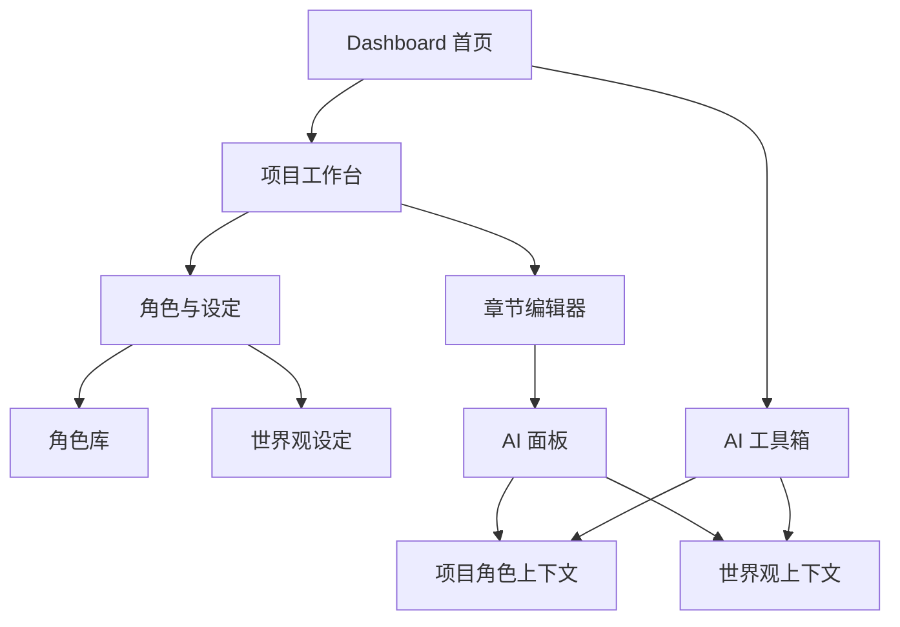

# Phase 2 详细规划

> 本文档承接 [`plans/phase1-completed-summary.md`](./phase1-completed-summary.md) 的阶段结论，作为 StoryWeave 下一轮开发的实施规划。Phase 2 的目标不是继续横向堆功能，而是围绕创作上下文资产，增强项目可持续写作能力与 AI 上下文质量。

## 一、Phase 2 总目标

Phase 2 聚焦四件事：
- 建立可复用的角色库体系
- 建立项目内世界观与设定沉淀能力
- 让项目工作台、编辑器、AI 工具箱都能消费这些上下文
- 为后续 Prompt 模板与长篇上下文管理打基础

换句话说，Phase 2 的核心不是新增更多独立工具页，而是让现有写作主链路拥有更强的上下文基础设施。

## 二、范围定义

### 纳入本轮范围
1. 全局角色库基础能力
2. 项目内角色关联能力
3. 世界观与项目设定页
4. AI 上下文注入的最小闭环
5. 为 Prompt 模板阶段预留数据接口与结构位置

### 暂不纳入本轮范围
1. 大纲树编辑器
2. 长篇上下文自动摘要系统
3. 风格分析系统
4. 一键全流程生成
5. 多用户协作
6. 导出能力增强

## 三、产品目标

### 1. 角色从文本备注升级为结构化资产
用户不应只在正文或备注中零散记录人物设定，而应能够：
- 创建角色卡
- 维护角色背景、性格、外观、说话风格
- 将角色挂接到具体项目
- 在写作与 AI 任务中复用这些角色信息

### 2. 世界观从隐式知识升级为项目级设定
用户应能够为项目维护：
- 时间背景
- 地点与势力
- 世界规则
- 设定补充说明

### 3. AI 消费结构化上下文
AI 续写、改写、润色、设定辅助等任务，后续都应从项目角色与世界观中自动提取最小必要上下文，而不是完全依赖用户临时补 prompt。

## 四、目标信息架构

## 五、功能模块规划

### 模块 1：全局角色库

#### 目标
建立项目外可复用的角色资产中心。

#### 计划能力
- 角色列表页
- 角色创建、编辑、删除
- 角色字段：姓名、来源作品、标签、性格、背景、外观、说话风格、补充备注
- 支持基础搜索与标签筛选

#### 前端页面建议
- [`frontend/src/pages/characters-page.tsx`](../frontend/src/pages/characters-page.tsx)

#### 后端能力建议
- `GET /api/characters`
- `POST /api/characters`
- `GET /api/characters/{id}`
- `PATCH /api/characters/{id}`
- `DELETE /api/characters/{id}`

### 模块 2：项目内角色关联

#### 目标
让角色不只是全局存在，还能与具体项目绑定并参与写作上下文。

#### 计划能力
- 在项目工作台查看已关联角色
- 从全局角色库选择并加入当前项目
- 支持移除项目角色关联
- 为后续 AI 任务选择相关角色预留入口

#### 前端落点建议
- 在 [`frontend/src/pages/project-workspace-page.tsx`](../frontend/src/pages/project-workspace-page.tsx) 增加角色侧栏或设定卡片区
- 在后续的角色详情抽屉中显示“已关联项目”

#### 后端能力建议
- `GET /api/projects/{id}/characters`
- `POST /api/projects/{id}/characters`
- `DELETE /api/projects/{id}/characters/{characterId}`

### 模块 3：世界观与项目设定页

#### 目标
为单个项目提供稳定、可维护的世界观信息来源。

#### 计划能力
- 世界观编辑页
- 设定字段：名称、时代背景、地点、规则、阵营、补充 lore、氛围说明
- 从项目工作台快速进入世界观页
- 为 AI 提供项目级设定摘要来源

#### 前端页面建议
- [`frontend/src/pages/project-world-page.tsx`](../frontend/src/pages/project-world-page.tsx)

#### 后端能力建议
- `GET /api/projects/{id}/world`
- `PUT /api/projects/{id}/world`

### 模块 4：AI 上下文注入最小闭环

#### 目标
让现有 AI 页面可以消费结构化角色与世界观数据。

#### 本轮只做最小闭环
- 编辑器 AI 面板在生成前拉取当前项目角色与世界观摘要
- AI 工具箱在有项目上下文时，自动拼接角色与世界观摘要
- 暂不引入复杂上下文裁剪策略
- 先保证结构化信息可进入 prompt

#### 受影响页面
- [`frontend/src/pages/project-editor-page.tsx`](../frontend/src/pages/project-editor-page.tsx)
- [`frontend/src/pages/ai-toolbox-page.tsx`](../frontend/src/pages/ai-toolbox-page.tsx)

#### 受影响服务
- 后端 AI prompt 组装逻辑
- 项目详情聚合接口可能需要扩展角色与世界观摘要字段

## 六、数据模型规划

### 1. Character
建议字段：
- `id`
- `name`
- `source_work`
- `tags`
- `personality`
- `backstory`
- `appearance`
- `speech_pattern`
- `notes`
- `created_at`
- `updated_at`

### 2. ProjectCharacter
建议字段：
- `project_id`
- `character_id`
- `role_in_project`
- `sort_order`

### 3. WorldSetting
建议字段：
- `id`
- `project_id`
- `name`
- `time_period`
- `location`
- `rules`
- `factions`
- `lore`
- `atmosphere`
- `updated_at`

## 七、页面与路由规划

### 新增页面
- [`frontend/src/pages/characters-page.tsx`](../frontend/src/pages/characters-page.tsx)
- [`frontend/src/pages/project-world-page.tsx`](../frontend/src/pages/project-world-page.tsx)

### 现有页面改造
- [`frontend/src/pages/dashboard-page.tsx`](../frontend/src/pages/dashboard-page.tsx)
  - 增加角色库与设定入口预留位
- [`frontend/src/pages/project-workspace-page.tsx`](../frontend/src/pages/project-workspace-page.tsx)
  - 增加角色区与世界观入口
- [`frontend/src/pages/project-editor-page.tsx`](../frontend/src/pages/project-editor-page.tsx)
  - 在 AI 面板中消费项目角色与世界观上下文
- [`frontend/src/pages/ai-toolbox-page.tsx`](../frontend/src/pages/ai-toolbox-page.tsx)
  - 在上下文文本组装逻辑中引入结构化设定摘要

## 八、接口与聚合策略

### 建议新增 API
- 角色 CRUD
- 项目角色关联 CRUD
- 项目世界观查询与更新

### 建议扩展 API
- [`backend/app/api/routes/projects.py`](../backend/app/api/routes/projects.py) 中的项目详情接口
  - 可考虑返回角色摘要
  - 可考虑返回世界观摘要

### 设计原则
- 优先扩展现有项目详情聚合能力，避免前端过多分散请求
- 复杂详情页仍可采用独立接口
- 保持返回结构与现有 [`frontend/src/types/api.ts`](../frontend/src/types/api.ts) 风格一致

## 九、实施顺序（按当前进度校准）

### Step 1：数据层与基础接口
状态：**已完成**
- 已具备角色、项目角色关联、世界观的数据模型
- 已补齐对应 API 路由与前端服务层
- Alembic 迁移已存在并覆盖当前模型演进

### Step 2：角色库页面
状态：**基本完成，可继续打磨**
- 已存在 [`frontend/src/pages/characters-page.tsx`](../frontend/src/pages/characters-page.tsx)
- 已具备角色列表、创建、编辑、删除能力
- 后续重点转向筛选体验、文案一致性与交互细节优化

### Step 3：项目工作台接入设定入口
状态：**已部分完成**
- [`frontend/src/pages/project-workspace-page.tsx`](../frontend/src/pages/project-workspace-page.tsx) 已接入角色绑定、角色编辑、世界观保存
- 当前已形成“项目工作台维护角色与设定”的最小闭环
- 后续仍可继续优化信息层级、入口组织与表达完整度

### Step 4：世界观页面
状态：**未完成，建议作为下一优先级**
- 目前世界观维护主要集成在项目工作台内
- 原规划中的 [`frontend/src/pages/project-world-page.tsx`](../frontend/src/pages/project-world-page.tsx) 尚未落地
- 建议下一步明确是否拆分独立路由与页面，以降低工作台复杂度

### Step 5：AI 上下文接入
状态：**未完成，为当前核心主线**
- 需要让编辑器在生成前消费项目角色与世界观摘要
- 需要让 AI 工具箱在有项目上下文时自动拼接结构化设定
- 需要完成最小 prompt 注入闭环验证

### Step 6：Phase 2 文档与验收沉淀
状态：**未完成，需并行推进**
- 新增一份 Phase 2 当前状态结论文档
- 新增一份 Phase 2 验收清单
- 在完成 AI 上下文接入后补齐阶段总结，形成新的主执行基线

## 十、验收标准

本阶段完成后，应至少满足以下结果：
- 用户可以创建和维护角色卡
- 用户可以将角色关联到项目
- 用户可以维护项目世界观
- 项目工作台可以展示角色与设定入口
- 编辑器与 AI 工具箱可以消费角色和世界观上下文
- 当前实现不会破坏既有 Phase 1 主流程

## 十一、与后续阶段的衔接

Phase 2 完成后，将为以下后续能力提供基础：
- Prompt 模板系统
- 长篇上下文管理
- 角色一致性检查
- 世界观冲突检查
- 大纲与章节自动生成

## 十二、建议的下一模式任务

当前建议继续在 [`code`](code) 模式下，按以下顺序实施：
1. 优先实现编辑器与 AI 工具箱的结构化上下文接入
2. 补齐独立世界观页面与对应路由，决定其与工作台的职责边界
3. 产出 Phase 2 当前状态文档与验收清单
4. 以新的 Phase 2 基线继续推进后续交互优化与验收
