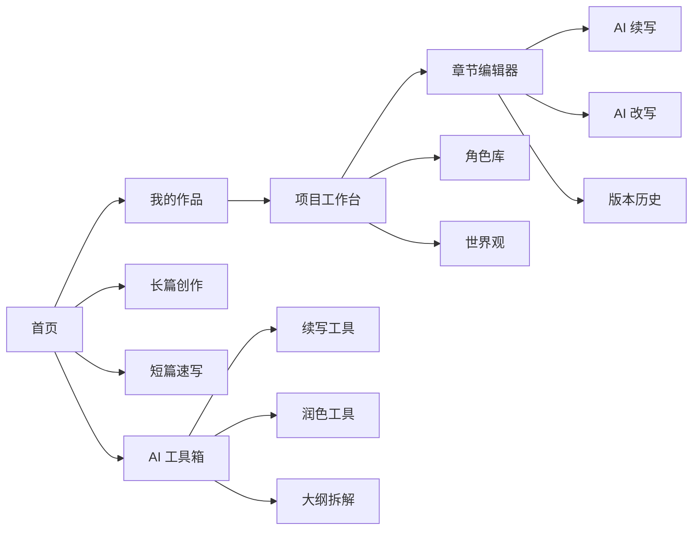

# StoryWeave 产品与前端布局升级建议

## 背景
基于当前项目既有实现与参考截图风格，提炼适合 [`StoryWeave`](../PLAN.md) 的产品扩展方向。目标不是照搬参考站点，而是吸收其更成熟的产品表达方式，并结合当前项目已经具备的项目管理、章节编辑、AI 续写、版本历史与运行时模型配置能力，形成更清晰的写作工作台。

## 适合 StoryWeave 汲取的经验

### 1. 把产品入口从 功能列表 改成 创作场景
参考图里最值得借鉴的不是视觉本身，而是它把入口组织成：
- 长篇写作
- 短篇写作
- 小说拆书
- AI 工具
- 工作流

这类组织方式对普通作者更友好，因为用户首先想到的是 我要做什么，而不是 我要点哪个功能。

对 [`StoryWeave`](../PLAN.md) 而言，可以把现有能力重组为以下创作场景入口：
- 长篇项目创作
- 短篇灵感速写
- 章节续写与改写
- 角色与世界观构建
- AI 工具箱

### 2. 首页要强调 我最近在写什么
参考图的近期作品区域非常关键，它天然回答两个问题：
- 我上次写到哪了
- 我现在该点哪里继续

当前项目已经有项目列表和章节数据能力，因此首页应强化：
- 最近编辑项目
- 最近编辑章节
- 当前章节进度
- 一键继续写作

这会比单纯项目卡片更贴近真实写作工作流。

### 3. 明确区分 创作工作台 与 工具市场
参考图把创作入口和 AI 工具入口拆开，这一点很重要。

对于 [`frontend/src/pages/project-editor-page.tsx`](../frontend/src/pages/project-editor-page.tsx) 当前的实现来说，AI 更像编辑器侧边功能；但从产品角度，应该再补出一个独立的 AI 工具层，例如：
- 续写
- 改写
- 润色
- 缩写
- 扩写
- 场景生成
- 对话生成
- 章节总结
- 人设补全

也就是说：
- 项目页负责组织作品结构
- 编辑器页负责具体写作
- AI 工具页负责可复用的创作能力集合

### 4. 用 卡片化能力描述 降低理解成本
参考图中的每个模块都用了：
- 标题
- 一句话价值说明
- 3 个左右的核心收益点
- 一个明显的行动按钮

这对当前项目后续首页改版非常适合。因为 [`plans/mvp-phase1-next-step.md`](./mvp-phase1-next-step.md) 里已经提到当前阶段重点是体验收口，而不是继续堆技术细节。前端表达上应减少接口、模型、配置这些术语直接暴露给用户，而把价值翻译成：
- 帮你理清大纲
- 避免人物写崩
- 自动生成章节草稿
- 根据设定补全细节

## 推荐的产品定位提炼

结合 [`PLAN.md`](../PLAN.md:5) 的目标，建议将 StoryWeave 的产品定位收敛为：

> 面向小说与同人作者的 AI 写作工作台，聚焦 长篇项目管理、章节写作协作、设定一致性控制 与 AI 辅助创作流水线。

这个定位比泛 AI 工具平台 更适合当前项目阶段，原因是：
- 当前已经有项目与章节结构
- 已有 AI 续写链路
- 已有版本历史
- 后续计划中本来就包括角色、世界观、风格、模板、工作流

也就是说，最该强化的是 写作工作台，而不是 工具广场先行。

## 前端信息架构建议

### 一级导航建议
参考截图的左侧导航思路，但更聚焦写作主线，建议采用：

- 首页
- 我的作品
- 写作工作台
- 角色库
- 世界观
- AI 工具箱
- Prompt 模板
- 工作流
- 使用说明

其中：
- 首页负责总览与入口
- 我的作品负责项目列表
- 写作工作台负责按项目进入结构化创作
- AI 工具箱负责独立工具页
- 工作流负责一键生成链路与批量任务

## 核心页面布局方案

### 1. 首页 Dashboard
目标：让用户快速进入继续创作，而不是先做配置。

建议分为 5 块：

1. Hero 区
- 标题：AI 写作工作台，让灵感落地成作品
- 副标题：覆盖长篇规划、章节续写、设定管理与 AI 辅助修改
- 主按钮：开始创作
- 次按钮：查看最近作品

2. 创作入口卡片区
- 长篇创作
- 短篇速写
- AI 章节续写
- 角色设定构建
- 小说拆解与大纲提炼

3. 最近作品区
- 最近项目
- 最近章节
- 当前进度
- 继续写作按钮

4. AI 工具精选区
- 续写
- 润色
- 改写
- 节奏优化
- 角色对白增强

5. 工作流入口区
- 从灵感到大纲
- 从大纲到分章
- 从分章到草稿
- 从草稿到润色

### 2. 我的作品页
当前项目已经具备基础项目管理，可以升级为双层视图：

- 卡片视图：适合快速浏览作品
- 列表视图：适合看更新时间、章节数、字数、状态

每个项目卡片建议显示：
- 项目标题
- 类型标签：原创 / 同人 / 长篇 / 短篇
- 当前章节
- 总章节数
- 总字数
- 最后编辑时间
- 快速操作：继续写、查看大纲、更多

### 3. 项目工作台页
参考图中的 章节管理 + 作品侧栏 思路，建议变成三栏式：

- 左栏：项目结构导航
  - 卷 / 章树
  - 角色
  - 世界观
  - 设定条目
  - 版本入口

- 中栏：当前工作区
  - 项目概览
  - 大纲卡片
  - 当前章节摘要
  - 最近生成记录
  - 待处理建议

- 右栏：AI 助手区
  - 本次任务目标
  - 快捷工具按钮
  - 模型状态
  - 最近 AI 结果

### 4. 写作编辑器页
当前 [`frontend/src/pages/project-editor-page.tsx`](../frontend/src/pages/project-editor-page.tsx) 已有基础能力，后续建议升级为更成熟的 编辑器工作台：

#### 推荐布局
- 顶部：章节标题、状态、字数、保存状态
- 左侧可折叠栏：章节树 / 版本历史 / 大纲定位
- 中间：正文编辑区
- 右侧：AI 辅助面板

#### 右侧 AI 面板建议拆成三个 Tab
- 续写
- 改写
- 设定辅助

续写 Tab：
- 本次使用模型
- 续写长度
- 风格偏好
- 指令输入
- 流式结果
- 接受 / 插入 / 替换

改写 Tab：
- 选中文本改写
- 语气：克制 / 热烈 / 文学化 / 口语化
- 节奏：更快 / 更慢 / 更紧张
- 保留原意开关

设定辅助 Tab：
- 提取本章人物
- 检查人物言行一致性
- 生成场景描写
- 检查设定冲突

### 5. AI 工具箱页
这个页面是最适合借鉴参考站 AI 工具广场 的地方。

建议按分类做工具卡片：
- 创作生成类
- 文本优化类
- 设定构建类
- 结构分析类

示例工具：
- 章节续写
- 场景扩写
- 对话生成
- 文风润色
- 节奏调整
- 摘要提炼
- 大纲拆章
- 人设补完
- 世界观补完
- 冲突检查

每张工具卡包含：
- 工具名
- 适用场景
- 依赖上下文
- 输出类型
- 立即使用按钮

## StoryWeave 特别值得强化的差异化能力

参考图更偏 通用 AI 写作平台，但 StoryWeave 更适合做深的方向有：

### 1. 项目上下文驱动生成
不是只给一个文本框，而是自动带入：
- 当前章节正文
- 上一章摘要
- 角色设定
- 世界观规则
- 项目风格

这正是 [`PLAN.md`](../PLAN.md:112) 已规划的上下文管理方向，应该在前端上显式呈现为：
- 本次生成参考了哪些上下文
- 用户可以勾选带入哪些上下文

### 2. 一致性控制
相比普通 AI 工具，小说创作最痛的是写崩。

建议围绕一致性做可见功能：
- 人设一致性提醒
- 世界观规则冲突提醒
- 章节时间线提醒
- 视角一致性提醒

这类能力特别适合成为 StoryWeave 的产品卖点。

### 3. 版本与接受机制
当前项目已经有 [`ChapterVersion`](../backend/app/models/project.py) 基础，这很适合延伸出：
- AI 生成前自动快照
- 插入前差异对比
- 接受部分结果
- 恢复到插入前版本

这比单纯一个生成框更专业。

## 建议补充进项目计划的功能方向

### MVP 增强项
适合尽快纳入近期规划：
- 首页改造成创作入口 + 最近作品
- 项目工作台增加更明确的结构导航
- 编辑器页增加 AI 工具分组与上下文说明
- AI 工具箱最小版本
- 最近生成记录与一键复用 Prompt
- 生成结果支持插入到光标处而非仅追加全文

### Phase 2 候选能力
- 角色库正式落地
- 世界观编辑页
- 章节摘要自动生成
- 上下文引用开关
- 版本差异对比

### 中期能力
- Prompt 模板中心
- 多步工作流编排
- 一键从设定生成大纲与章节
- 风格档案与风格一致性检查
- 项目级知识库与检索

## 页面关系 Mermaid 图

## 建议同步更新的项目文档

### 建议更新 [`PLAN.md`](../PLAN.md)
新增内容方向：
- 首页从项目列表升级为创作型仪表盘
- 增加 AI 工具箱页
- 项目工作台采用三栏式结构
- 编辑器页强化 AI 多工具面板而非单一续写框
- 把 一致性控制 作为核心差异化能力写入规划

### 建议更新 [`plans/mvp-phase1-next-step.md`](./mvp-phase1-next-step.md)
新增内容方向：
- 将体验收口范围扩展到首页信息架构
- 增加 AI 面板与项目工作台的交互语义优化
- 为 Phase 2 提前定义角色库 / 世界观 / AI 工具箱入口边界

## 建议的实施顺序

1. 先重做首页信息架构
2. 再重做项目工作台布局
3. 再升级编辑器右侧 AI 面板为多工具面板
4. 再补最小 AI 工具箱页
5. 最后补角色与世界观页面

## 结论
StoryWeave 最值得吸收的，不是参考站点的视觉皮肤，而是它的三点产品表达：
- 用创作场景组织入口
- 用最近作品承接回流
- 用工具卡片降低 AI 功能理解门槛

而 StoryWeave 自己最应该强化的，是参考站点未必做深但你项目天然适合做深的部分：
- 项目级上下文注入
- 人设与世界观一致性控制
- 章节级版本与 AI 接受机制
- 围绕长篇创作的结构化工作台
